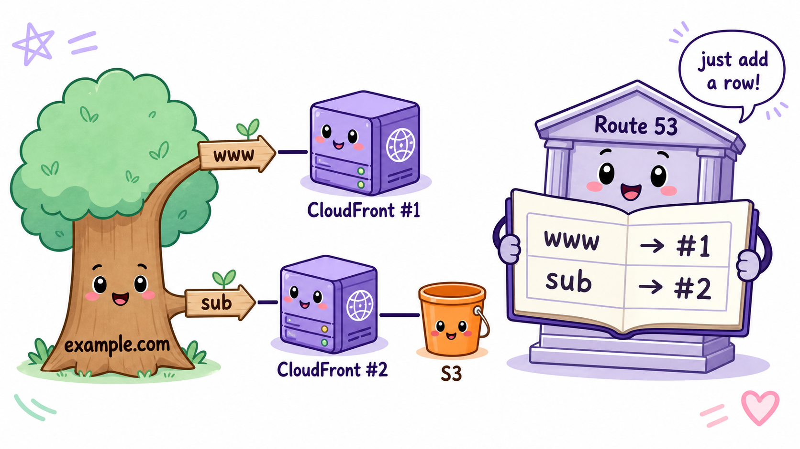
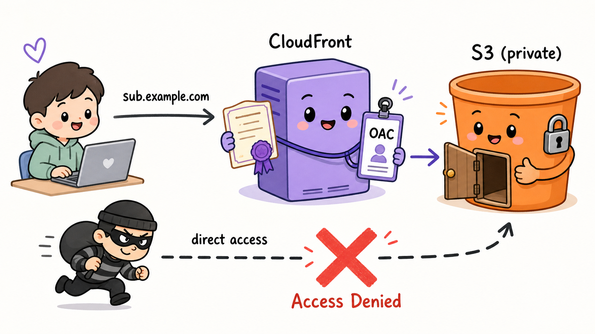

# サブドメインで別の S3(静的サイト)を公開する — 完全初心者向け手順と解説

> **前提**:[独自ドメインとHTTPS化の仕組み解説](./独自ドメインとHTTPS化の仕組み解説.md) の構成
> (お名前.com → Route 53 → ACM → CloudFront)が完成していること。
>
> **今回やること**:同じドメインのサブドメイン(例: `sub.example.com`)で、
> **静的ファイルだけを置いた別の S3 バケット**を HTTPS 公開する。

---

## 0. まず結論:何を作るのか

```
今あるもの:
  example.com ──> CloudFront ① ──> 既存のオリジン

今回作るもの:
  sub.example.com ──> CloudFront ②(新規)──> S3 バケット(新規・非公開)
```

**新しく作るのは3つだけ**です:

| 作るもの | 個数 | 役割 |
|---|---|---|
| S3 バケット | 1 | 静的ファイル(HTML/CSS/JS/画像)の置き場 |
| CloudFront ディストリビューション | 1 | HTTPS と独自ドメインの窓口 |
| Route 53 の A レコード(エイリアス) | 1行 | `sub` → CloudFront② の案内 |

**作らなくていいもの**(ここが初心者の勘違いポイント):

- ❌ 新しいドメインの購入 — 不要。サブドメインは買うものではない(後述)
- ❌ お名前.com での作業 — 一切不要。委任済みなので Route 53 だけで完結
- ❌ 新しいホストゾーン — 不要。既存のホストゾーンに1行足すだけ
- ❌ 新しい証明書 — `*.example.com`(ワイルドカード)で発行済みなら再利用できる

---

## 1. そもそもサブドメインとは(なぜ買わなくていいのか)

`sub.example.com` の `sub` の部分がサブドメインです。

ドメインは**住所のように階層構造**になっています:

```
.com                ← 国レベル(レジストリが管理)
example.com         ← あなたが「購入」した土地
sub.example.com     ← その土地の中に建てた離れ。増築は自由!
www.example.com     ← 同じく離れ。いくつ作っても無料
```

お金を払って買ったのは `example.com` という「土地」です。
**その土地の中をどう区切るかは持ち主の自由**なので、サブドメインは
Route 53 のホストゾーン(=あなたのドメインの台帳)に**1行書き足すだけ**で無限に作れます。
誰の許可も、追加料金も要りません。



---

## 2. なぜ S3 だけではダメで、CloudFront をもう1つ立てるのか

「S3 に静的サイトホスティング機能があるなら、直接ドメインを向ければいいのでは?」
と思うのが自然ですが、**S3 単体では今回の要件を満たせません**:

| 要件 | S3 単体 | CloudFront 経由 |
|---|---|---|
| HTTPS(証明書) | ❌ 独自ドメインの証明書を設定できない | ✅ ACM 証明書を設定できる |
| 独自ドメイン | △ バケット名をドメイン名に一致させる縛りあり | ✅ 代替ドメイン名で自由 |
| バケットを非公開に保つ | ❌ 世界に公開する必要がある | ✅ 非公開のまま配信できる |
| 高速配信・キャッシュ | ❌ | ✅ |

つまり **「証明書を持てるのは CloudFront」** なので、HTTPS で独自ドメイン公開する以上、
S3 の前に CloudFront を置くのが AWS の定石です。
CloudFront ディストリビューションは**ドメイン(窓口)ごとに1つ**作るのが基本なので、
既存の①とは別に②を新規作成します。

### OAC:バケットを世界に公開しないための仕組み

S3 バケットは**非公開のまま**にして、「CloudFront ② からのアクセスだけ許可する」設定にします。
これを **OAC(Origin Access Control)** と呼びます。

- CloudFront がバケットにアクセスするとき、AWS が署名した「社員証」を提示する
- バケットポリシー(バケットの入場ルール)には「この社員証を持つ CloudFront ② だけ入場可」と書く
- 一般ユーザーやbotがバケット URL に直接アクセスしても **Access Denied**

こうする理由:バケットを公開にすると、CloudFront を迂回した直接アクセス(キャッシュも
HTTPS 強制も効かない裏口)ができてしまうため。**玄関を CloudFront に一本化**するのが目的です。



---

## 3. 手順(マネジメントコンソール)

### Step 1: S3 バケットを作る

1. S3 コンソール → 「バケットを作成」
2. バケット名:任意(例: `sub-example-com-static`)。リージョンは**どこでもよい**(東京でOK)
3. 「パブリックアクセスをすべてブロック」= **オンのまま**(非公開でよいのがOACの利点)
4. 作成後、静的ファイル(`index.html` など)をアップロード

> 💡 **意味**:ただのファイル置き場を作っただけ。この時点では誰もアクセスできない金庫。
> 「静的ウェブサイトホスティング」機能は**有効にしなくてよい**(あれは公開バケット用の古い方式)。

### Step 2: 証明書を確認する(us-east-1)

1. ACM コンソールを **バージニア北部 (us-east-1)** に切り替え
2. 既存の証明書に `*.example.com` が含まれているか確認
   - **含まれている** → そのまま再利用。何もしなくてよい
   - **`example.com` 単体しかない** → 新しく `sub.example.com`(または `*.example.com`)で
     証明書をリクエスト。DNS 検証 →「Route 53 でレコードを作成」ボタン → 数分で発行
     (この仕組みの意味は前ドキュメント §3 参照)

> 💡 **意味**:`*.example.com` の `*` は「どんなサブドメインでも一致」のワイルドカード。
> 1枚で `www` も `sub` も `api` も全部カバーできる万能身分証。

### Step 3: CloudFront ディストリビューションを新規作成

1. CloudFront コンソール → 「ディストリビューションを作成」
2. **オリジン**:Step 1 のバケットを選択(`.s3.リージョン.amazonaws.com` の方。
   `s3-website` で始まる方は選ばない)
3. **オリジンアクセス**:「Origin access control settings (OAC)」を選択 → OAC を新規作成
4. **ビューワープロトコルポリシー**:「Redirect HTTP to HTTPS」
5. **代替ドメイン名 (CNAME)**:`sub.example.com` を入力
6. **カスタム SSL 証明書**:Step 2 の証明書を選択
7. **デフォルトルートオブジェクト**:`index.html`
8. 作成

> 💡 **意味**:「`sub.example.com` 名義の窓口」を開設した。
> 代替ドメイン名 = 「この名前で来た客は私宛」という宣言、
> 証明書 = その名前を名乗る資格の身分証(毎アクセスのTLSハンドシェイクで提示される)。

### Step 4: バケットポリシーを貼る(OACの入場ルール)

ディストリビューション作成直後に「バケットポリシーをコピーしてください」と案内が出るので、
コピーして S3 バケットの「アクセス許可 → バケットポリシー」に貼り付け。内容はこういう意味:

```json
{
  "Statement": [{
    "Effect": "Allow",
    "Principal": { "Service": "cloudfront.amazonaws.com" },
    "Action": "s3:GetObject",
    "Resource": "arn:aws:s3:::バケット名/*",
    "Condition": {
      "StringEquals": {
        "AWS:SourceArn": "arn:aws:cloudfront::アカウントID:distribution/ディストリビューションID"
      }
    }
  }]
}
```

> 💡 **意味**:日本語に訳すと
> 「CloudFront というサービスが、**ただし ② のディストリビューション経由に限り**、
> このバケットのファイルを読むこと(GetObject)を許可する」。
> `Condition` の1行があるおかげで、他人の CloudFront からは読めない。

### Step 5: Route 53 に1行足す

1. Route 53 → 既存のホストゾーン → 「レコードを作成」
2. レコード名:`sub`
3. タイプ:`A`
4. 「エイリアス」を**オン** → 「CloudFront ディストリビューションへのエイリアス」→ ② を選択
5. 作成

> 💡 **意味**:台帳に「`sub` と聞かれたら CloudFront ② を案内せよ」の1行を追記。
> これがサブドメイン発行の実体のすべて。購入も申請も存在しない。

### Step 6: 動作確認

```bash
# 案内が効いているか(CloudFrontのドメインやIPが返ればOK)
dig sub.example.com

# HTTPSで開けるか(200が返ればOK)
curl -I https://sub.example.com

# 直接アクセスが拒否されるか(AccessDeniedならOK = OACが効いている)
curl -I https://バケット名.s3.リージョン.amazonaws.com/index.html
```

ブラウザで `https://sub.example.com` を開き、🔒マークと `index.html` の内容が出れば完成。

---

## 4. アクセス時に裏側で起きること(通し)

前ドキュメントの「EVERY ACCESS」と同じ流れが、新しい登場人物で繰り返されるだけです:

```
1. ブラウザ「sub.example.com はどこ?」
      → Route 53 が Step 5 の1行を見て CloudFront ② を案内

2. TLSハンドシェイク
      → CloudFront ② が *.example.com の証明書を提示 + 秘密鍵の実演
      → ブラウザ「sub.example.com は *.example.com に一致。本物」🔒

3. CloudFront ② がコンテンツを用意
      → キャッシュにあれば即返す
      → なければ OAC の社員証を持って S3 バケットへ → index.html を取得

4. 表示 🎉(2回目以降はエッジのキャッシュから爆速)
```

**新しい概念は OAC だけ**で、あとは前回学んだ仕組みの再利用だと分かるはずです。

---

## 5. よくあるハマりポイント

| 症状 | 原因と対処 |
|---|---|
| ブラウザで証明書エラー | 証明書が `example.com` 単体で `*.example.com` を含んでいない。Step 2 参照 |
| `Access Denied` が表示される | バケットポリシー未設定(Step 4 忘れ)/ デフォルトルートオブジェクト未設定 |
| `/about/` などサブパスで Access Denied | S3+OAC 構成では `xxx/index.html` の自動補完が効かない。CloudFront Function で URL 書き換えを入れる(発展) |
| 更新したのに古いファイルが出る | CloudFront のキャッシュ。「キャッシュ削除(Invalidation)」で `/*` を指定 |
| 証明書が選択肢に出ない | us-east-1 以外で発行している(前ドキュメントと同じ罠) |
| `dig` で何も返らない | Route 53 のレコード名のタイポ、または反映待ち |

---

## 6. まとめ

- サブドメインは「買う」ものではなく、**自分の台帳(ホストゾーン)に1行足すだけ**
- S3 は証明書を持てないので、**HTTPS+独自ドメインの窓口として CloudFront をもう1つ**立てる
- バケットは非公開のまま、**OAC で「CloudFront ② だけ入場可」**にするのが現代の定石
- 毎アクセスの流れ(DNS → TLSハンドシェイク → 配信)は前回学んだものと完全に同じ
- 費用:追加ドメイン代 0円 / S3 数円〜 / CloudFront 無料枠あり。ほぼタダで増やせる
