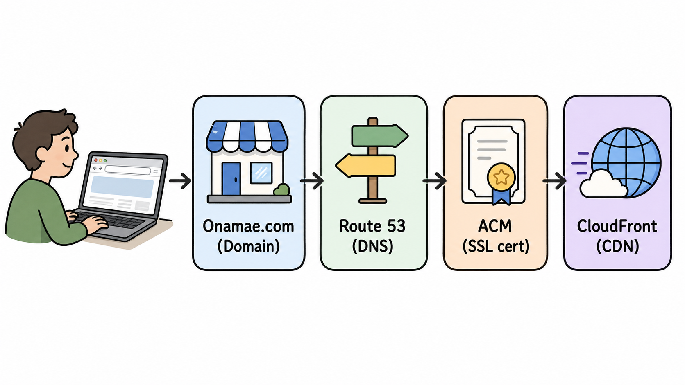
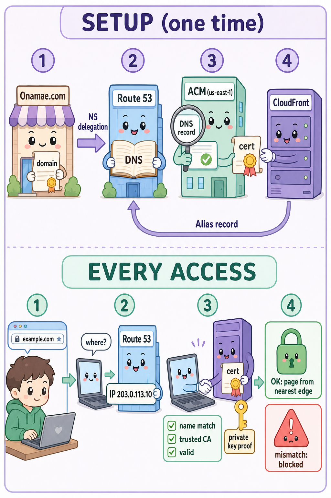
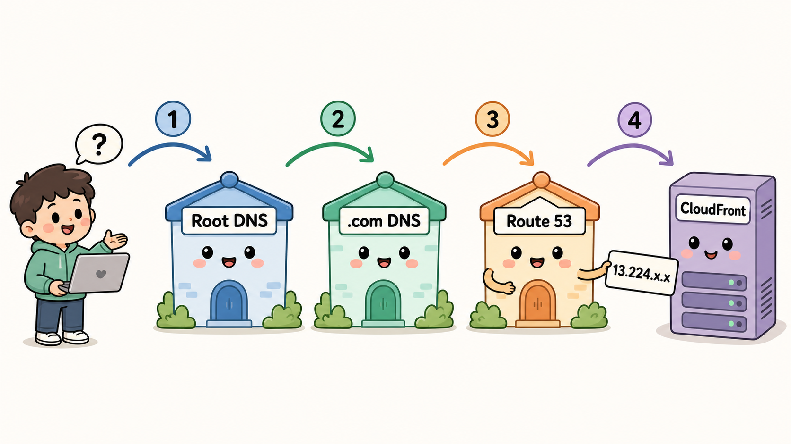
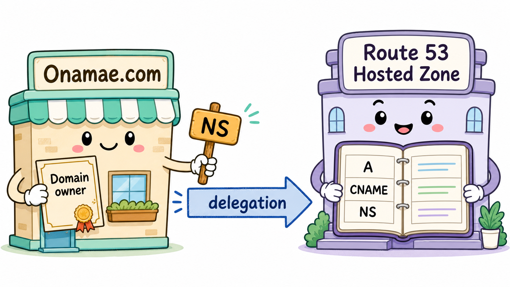
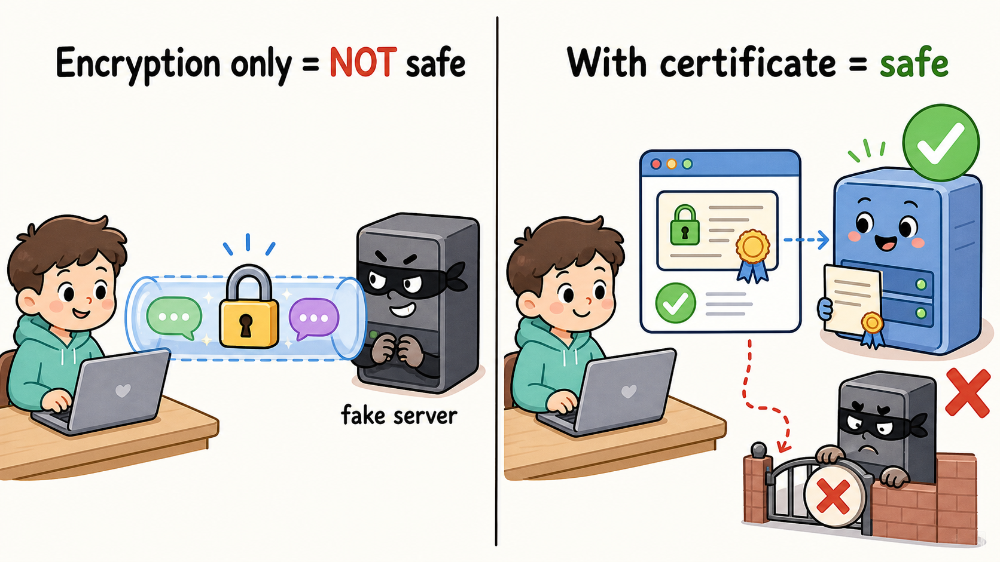
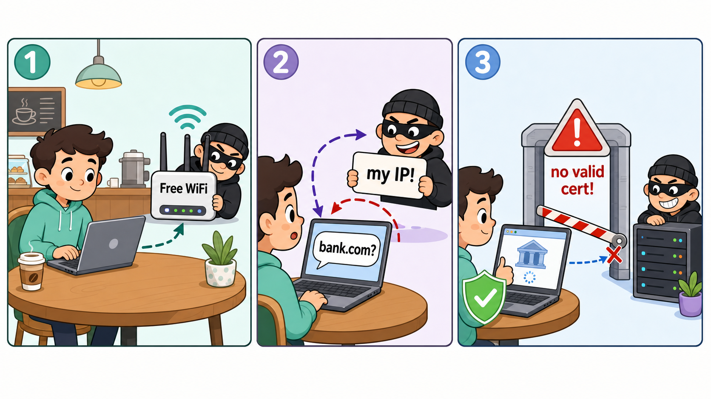
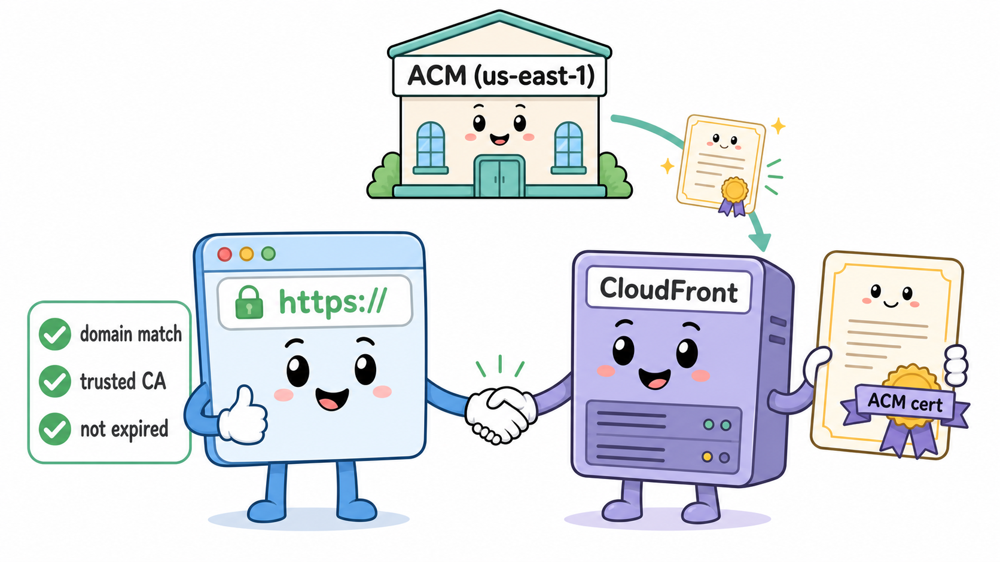
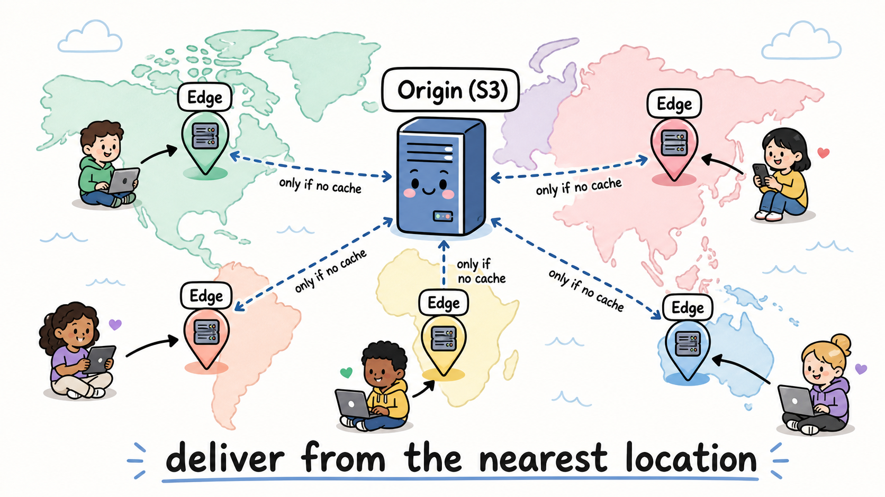

# 独自ドメインで HTTPS のサイトを公開する仕組み — 完全初心者向け解説

> **この構成の全体像**
> お名前.com でドメイン取得 → Route 53 にホストゾーン作成 → ACM で SSL 証明書発行 → CloudFront に紐付け



### 📌 この1枚で全部わかるビジュアルアブストラクト

上段「SETUP(一度だけやる設定)」:①お名前.comでドメイン取得 → ②NS委任でRoute 53が案内係に → ③ACMがDNSレコードで本人確認して証明書発行 → ④CloudFrontに証明書を設置し、Route 53からエイリアスレコードで向ける。
下段「EVERY ACCESS(毎回のアクセスで起きること)」:①ユーザーがドメインを入力 → ②Route 53にIPアドレスを聞く → ③TLSハンドシェイク(証明書の提示+秘密鍵の実演+ブラウザの3点チェック)→ ④合格なら最寄りエッジから配信🔒、不一致ならブロック⚠。



このドキュメントは「そもそも DNS って何?」「証明書って何のため?」というレベルから、
今回作った構成の**裏側で何が起きているか**を順番に解説します。

---

## 0. 登場人物の整理

| 登場人物 | 役割 | 例えるなら |
|---|---|---|
| **お名前.com** | ドメインを「購入・所有」する場所(レジストラ) | 土地の登記をしてくれる不動産屋 |
| **Route 53** | ドメイン名の「案内板」を管理する DNS サービス | 住所を聞かれたら道案内する案内所 |
| **ACM** (AWS Certificate Manager) | SSL/TLS 証明書を無料で発行してくれる | 「このサイトは本物です」と保証する身分証の発行所 |
| **CloudFront** | 世界中にコンテンツを高速配信する CDN | コンテンツの配達員(世界中に支店がある) |

ポイント:**「ドメインの所有」と「ドメインの案内(DNS)」は別の仕事**です。
お名前.com で買ったドメインの案内係を、Route 53 に任せている、というのが今回の構成です。

### まるごと一つのたとえ話にすると

「お店(Webサイト)を開く」ことに例えると、今回やったことはこうなります:

1. **お名前.com** で「店の名前(屋号)」を登録した。名前の権利はここが管理してくれる。
2. ただし「その店はどこにあるの?」と聞かれたときの**道案内係**は **Route 53** にお願いした(=ネームサーバーの委任)。
3. お客さんに「この店は本物で、会話も盗み聞きされません」と示すための**営業許可証(SSL証明書)**を **ACM** という役所で無料発行してもらった。
4. 実際の接客は、世界中に支店を持つ配達チェーン **CloudFront** が担当。お客さんは一番近い支店から商品(Webページ)を受け取る。

つまり「名前の登記」「道案内」「本人証明」「実際の配達」を、それぞれ得意な担当者に分けているだけです。この分担が分かれば、この構成は怖くありません。

---

## 1. そもそもドメインと DNS とは

コンピュータは `example.com` という名前ではなく、`13.224.xx.xx` のような **IPアドレス**で通信します。
名前 → IPアドレス の変換をするのが **DNS(Domain Name System)** です。電話帳のようなものです。



ブラウザに `www.example.com` と打つと、裏側ではこうなっています:

```
ブラウザ「www.example.com のIPアドレス教えて」
   ↓
① ルートDNSサーバー「.com のことは .com のサーバーに聞いて」
   ↓
② .com のサーバー「example.com のことは Route 53 の ns-xxxx に聞いて」← ここが重要!
   ↓
③ Route 53 のホストゾーン「それは CloudFront の dxxxx.cloudfront.net だよ」
   ↓
ブラウザ、CloudFront に接続 → ページ表示
```

②で「Route 53 に聞いて」と案内されるのは、**お名前.com 側でネームサーバー(NS)を Route 53 のものに変更したから**です。これが「委任」と呼ばれる仕組みです。

---

## 2. お名前.com と Route 53 の関係(ネームサーバーの委任)



### やったこと
1. お名前.com でドメインを購入(= 所有権を得る)
2. Route 53 で**ホストゾーン**を作成(= このドメイン用の DNS レコード置き場)
3. ホストゾーン作成時に自動発行される **NS レコード(4つのネームサーバー)** を確認
   例: `ns-1234.awsdns-56.org` など4つ
4. お名前.com の管理画面で「ネームサーバーの変更」→ その4つを登録

### 裏側で起きていること
- お名前.com は「.com の大元の台帳(レジストリ)」に対して
  「このドメインの DNS は Route 53 のこのサーバーが担当します」と登録します。
- 以降、世界中の誰かがこのドメインを引くと、**Route 53 のホストゾーンの中身が答えとして返る**ようになります。
- つまりお名前.com の役割は「所有と更新料の支払い」だけになり、
  日々の DNS 設定はすべて Route 53 側で行います。

> ⚠️ NS 変更は世界中の DNS キャッシュに広がるまで数分〜最大48時間かかることがあります(「浸透」と呼ばれる現象)。

---

## 3. HTTPS と証明書(ACM)とは

### なぜ証明書が必要?(暗号化だけでは足りない理由)

HTTPS がやりたいことは2つあり、証明書は2つ目のために存在します。

1. **暗号化** — 通信の中身を盗み見されないようにする
2. **本人確認** — 「暗号化して話している相手」がそもそも本物かを確かめる ← 証明書の仕事

直感に反しますが、**暗号化だけでは安全になりません**。
例えばカフェの偽 Wi-Fi に繋いでしまい、攻撃者がそっくりの偽サーバーを用意していたら、
あなたは「偽サーバーと」完璧に暗号化された通信をしてしまいます。
泥棒と二人きりの密室で丁寧に会話しているようなもので、暗号は完璧でも中身は全部相手に渡ります。



これを防ぐ仕組みが証明書です:

- ブラウザや OS には、出荷時点から「信頼できる認証局(CA)のリスト」が組み込まれている(Amazon もその一つ)
- 証明書 = 「このドメインの正当なサーバーはこの鍵を持っています」という宣言に、CA が**デジタル署名**したもの
- 署名は偽造・改ざんできないので、偽サーバーは「本物のドメイン名が入った有効な証明書」を提示できない
- → ブラウザは偽物を見抜ける。鍵マーク🔒は「相手は本物 & 暗号化済み」の証拠

そして後述の「DNS 検証」は、CA が署名する**前の身元調査**です。
あの本人確認があるからこそ「攻撃者が他人のドメインの証明書を勝手に発行する」ことができません。

### 発行した後、証明書は何をしているのか

「発行して終わり」ではなく、**誰かがサイトを開くたびに毎回働いています**:

1. CloudFront が証明書をブラウザに提示する
2. ブラウザが「CA の署名は有効か・ドメイン名は一致するか・期限内か」を検証(数ミリ秒)
3. OK なら、証明書に含まれる公開鍵を使って暗号化用の鍵を安全に交換 → 以降の通信が暗号化される

つまり証明書は「身分証」であると同時に、**暗号化を始めるための鍵の受け渡し道具**でもあります。

### 証明書がない(HTTPのまま)とどうなる?

現代では実質サイトとして成立しません:

- ブラウザに「**保護されていない通信**」と警告が出て、ユーザーが離脱する
- フォーム入力(パスワード等)に強い警告が出る
- Google 検索の評価(SEO)で不利になる
- 位置情報・カメラ・通知などのブラウザ機能や、HTTP/2 による高速化が **HTTPS 限定**

逆に ACM で発行しておけば**自動更新で今後やることは基本ゼロ**です
(昔は年1回の手動更新が定番の事故ポイントでした)。

### 「途中で書き換えられる」ってどういうこと?(最重要ポイント)

「ユーザーはドメインにアクセスしているんだから、それが正しいのでは?」——実は、**誰もドメインにはアクセスしていません**。ブラウザは名前では通信できず、IP アドレスでしか通信できないので、アクセスの実態は必ずこの2段階です:

1. 「`example.com` の IP アドレスは?」と**誰かに聞く**
2. **教えてもらった IP アドレス**に接続する

つまり「ドメインにアクセスした」の正体は**「誰かに教えてもらった住所にアクセスした」**です。
正しいドメイン名を打ったことは何の保証にもならず、「教えてくれた誰かが正直者なら」正しい場所に着くだけです。

そしてその「誰か」(DNSリゾルバ)は、**接続したネットワークが自動で指定してきます**。
Wi-Fi に繋いだ瞬間、ルーターが「DNSはここに聞いてね」という設定を配ります(DHCP)。ここが乗っ取りポイントになります。

**攻撃シナリオ(カフェの偽Wi-Fi):**

1. 攻撃者が「Free_Cafe_WiFi」という偽アクセスポイントを立てる
2. あなたが繋ぐ。「DNSは私(攻撃者)に聞いてね」という設定が自動で配られる
3. あなたはブラウザに**正しく** `あなたの銀行.com` と打つ。操作ミスはゼロ
4. PC が攻撃者の DNS に「`あなたの銀行.com` はどこ?」と聞く
5. 攻撃者「**私のサーバーの IP だよ**」と嘘をつく ← これが「途中で書き換えられる」の正体
6. ブラウザは疑いなくその IP に接続。そっくりの偽ログイン画面が表示される
7. パスワード入力 → 攻撃者の手に渡る



証明書があると、手順 6 の直前で攻撃が止まります。ブラウザが「`あなたの銀行.com` の証明書を見せて」と要求しても、攻撃者は正規 CA から他人のドメインの証明書を発行してもらえない(DNS 検証を突破できない)ため、ブラウザが接続を止めて真っ赤な警告を出します。

> **DNS = 案内は速いが、正直とは限らない**
> **証明書 = 着いた先で身分証を確認する門番**
> この2つが揃って初めて安全になる。

### 確認するのは誰? — TLSハンドシェイク

「でも案内されちゃってるじゃん」への答え:確認作業をするのは案内された側ではなく、
**あなたの手元のブラウザ自身**です。ブラウザは入力されたドメイン名を「期待値」として
手元に持ったまま移動するので、案内(DNS)がどんなに嘘でも期待値はいじれません。
着いた先でブラウザが行うこの照合の儀式を **TLSハンドシェイク** と呼びます。

1. ブラウザ「私は `example.com` に用がある。証明書を見せろ」
   (どのドメイン宛かの申告 = **SNI** と呼ばれる)
2. サーバーが証明書を提示
3. ブラウザが手元で検証:信頼できるCAの署名か / 証明書のドメイン名が**入力した名前と一致するか** / 期限内か
4. 合格して初めて通信開始。不合格なら接続を切って警告

**重要:証明書を「見せるだけ」では合格できない。**
証明書は公開情報なので、攻撃者も本物サイトの証明書をコピーして提示できます。
そこでブラウザは「この証明書とペアの**秘密鍵**を持っていることを、いま実演しろ」と要求します。
具体的には使い捨てのランダムな課題を送り、サーバーが秘密鍵で署名して返す(**秘密鍵の所有証明**)。
秘密鍵は本物のサーバー(今回は CloudFront)から一度も外に出ないため、
コピー犯はここで必ず失敗します。**身分証の提示 + その場でのサイン実演**のセットで本人確認が完了します。

**この仕組み全体を一文で言うと(暗記用):**

> ブラウザ「私は `example.com` と打ち込まれてここに案内されてきた。
> だからあなたは **`example.com` を名乗る資格があると認証局に証明されたサーバー**のはずだ。
> 証明書を見せて、秘密鍵の実演もして」

証明書は「このサーバーは `example.com` の正当な中の人です」という**名乗る資格の証明**。
アクセス経路の話は含まれず、ブラウザは「自分が入力した名前」と「証明書に書かれた名前」の一致だけを見ます。

### じゃあ、案内された先が違っていたら何が起きる?

ハンドシェイクの照合が**不合格**になり、次のことが起きます:

1. **ページは1ミリも表示されず、通信は確立前に切断される**
   証明書の確認は「データを送る前」に行われる。パスワードどころか、見ようとしたページの
   URLパスすらまだ送っていない。相手に渡るのは「`example.com` 宛です」という申告(SNI)程度。
2. **ブラウザが全画面の警告を出す**
   Chrome なら「この接続ではプライバシーが保護されません」+
   `NET::ERR_CERT_COMMON_NAME_INVALID`(名前不一致)や
   `NET::ERR_CERT_AUTHORITY_INVALID`(信頼できないCA)などのエラーコード付き。
3. **ただし人間は突破できてしまう**
   「詳細設定 → アクセスする(安全ではありません)」で検証失敗のまま接続できる。
   技術的防御はここまで。**「赤い警告が出たら進まない」がユーザー側の唯一のルール**。

なお「案内先が違う」=攻撃とは限りません。実際はこちらの方が圧倒的に多い:

| warning の原因 | 何が起きたか |
|---|---|
| CloudFront の代替ドメイン名に追加し忘れ | 自分の設定ミス。名前不一致で警告 |
| 証明書の期限切れ(手動更新運用の場合) | 期限切れで警告(ACM自動更新なら起きない) |
| DNS変更の反映待ちで古いサーバーに案内 | 旧サーバーの証明書と不一致で警告 |
| 偽Wi-Fi等による本物の攻撃 | 攻撃者は有効な証明書を出せず警告 |

つまり赤い警告は「攻撃されている」ではなく「**本人確認が取れなかった**」のサイン。
原因が攻撃か設定ミスかをブラウザは区別できないため、一律で止める設計になっています。

### よくある誤解:「ドメイン→CloudFrontへの接続をAWSが許可している」ではない

証明書は「このドメインは cloudfront.net にアクセスしてよい」という**接続の許可証ではありません**。
正しくは:

> 「このドメイン名を名乗る資格があるのは、この秘密鍵を持つサーバーだけ」と、
> 世界中のブラウザが信頼する認証局(Amazon)が保証している。

役割分担で覚えるのが正確です:

| 質問 | 答える人 | 保証 |
|---|---|---|
| 「このドメインはどこにあるの?」 | DNS(Route 53) | **なし**(案内するだけ。書き換えられる可能性もある) |
| 「着いた先のサーバーは本物?」 | 証明書(ACM) | **あり**(秘密鍵を持つ本物だけが証明に成功する) |

- ブラウザは DNS に案内された先に着いてから「本当に `このドメイン.com` 本人?証拠を見せて」と要求する
- 本物の CloudFront だけが ACM 証明書とペアの**秘密鍵**を持っているので、証明に成功する
- 証明書に `cloudfront.net` という名前は出てこない。ブラウザから見れば相手は終始「あなたのドメイン」
- AWS は ①認証局(ACM)として発行する役と ②秘密鍵を CloudFront に持たせて代理で提示する役 の2役をしている



### ACM でやったこと
1. ACM で「証明書のリクエスト」→ ドメイン名を入力(例: `example.com` と `*.example.com`)
2. 検証方法は **DNS 検証** を選択
3. ACM が「この CNAME レコードを DNS に置いてください」と指示
4. Route 53 にホストゾーンがあるので「Route 53 でレコードを作成」ボタン一発で追加
5. 数分後、ステータスが「発行済み」に

### 裏側で起きていること(DNS 検証の仕組み)
- ACM(認証局)は「そのドメインの DNS を操作できる = ドメインの持ち主本人」とみなします。
- 指定されたランダムな CNAME レコードが実際に DNS から引けたら、本人確認完了 → 証明書発行。
- この検証レコードを**置きっぱなし**にしておくと、証明書は**自動更新**されます(有効期限切れの心配なし)。

> ⚠️ **超重要な落とし穴**: CloudFront で使う ACM 証明書は
> **必ず「バージニア北部 (us-east-1)」リージョンで発行**する必要があります。
> 東京リージョンで発行した証明書は CloudFront の設定画面に出てきません。

---

## 4. CloudFront とは & 証明書との接続

### CloudFront の役割
CloudFront は **CDN(Content Delivery Network)**。世界中にある配信拠点(エッジロケーション)にコンテンツをキャッシュして、ユーザーに一番近い場所から高速配信します。オリジン(本体)は S3 や ALB などです。

```
ユーザー ──(近い)──> CloudFrontのエッジ ──(キャッシュなければ)──> オリジン(S3など)
```



### やったこと
1. CloudFront ディストリビューションの設定で:
   - **代替ドメイン名 (CNAMEs)** に独自ドメインを追加(例: `www.example.com`)
   - **カスタム SSL 証明書** に us-east-1 で発行した ACM 証明書を選択
2. これで CloudFront が「独自ドメイン + HTTPS」でアクセスを受けられる状態に

### 裏側で起きていること
- CloudFront は本来 `dxxxxxxxx.cloudfront.net` という名前で動いています。
- 「代替ドメイン名」を設定すると、独自ドメイン宛のリクエストも自分宛と認識します。
- HTTPS 接続時、CloudFront は設定された ACM 証明書をブラウザに提示し、
  ブラウザは「ドメイン名と証明書が一致している & 信頼された CA 発行」を確認して🔒を表示します。

---

## 5. Route 53 → CloudFront の向き先設定(エイリアスレコード)

### やったこと
Route 53 のホストゾーンに **A レコード(エイリアス)** を作成:

```
レコード名: www.example.com (またはルートドメイン)
タイプ:     A
エイリアス: はい
向き先:     CloudFront ディストリビューション (dxxxxxxxx.cloudfront.net)
```

### 裏側で起きていること
- 普通の CNAME ではなく **エイリアス(Alias)** という Route 53 独自の仕組みを使っています。
- CNAME はルートドメイン(`example.com` そのもの)には設定できないという DNS の規則がありますが、エイリアスなら可能です。
- エイリアスは DNS 応答の時点で CloudFront の実際の IP アドレス群(A レコード)に解決して返すので、余計な名前解決が1回減り、しかも**無料**(通常のクエリ課金なし)。

---

## 6. 全部つなげると:アクセス時に起きること(通し)

ブラウザで `https://www.example.com` を開いた瞬間の裏側:

```
1. DNS解決
   ブラウザ → ルート → .com → (お名前.comが登録した委任情報により) Route 53 へ
   Route 53 のエイリアスレコード → CloudFront エッジの IP を返す

2. TLS ハンドシェイク(HTTPSの確立)
   ブラウザ → CloudFront に接続
   CloudFront → ACM 証明書を提示
   ブラウザ → 「ドメイン一致OK・信頼できるCA・期限内」→ 🔒 暗号化通信開始

3. コンテンツ配信
   CloudFront エッジ → キャッシュにあれば即返す
                     → なければオリジン(S3等)から取得してキャッシュ&返す

4. ページ表示 🎉
```

---

## 7. よくあるハマりポイント集

| 症状 | 原因 |
|---|---|
| ACM 証明書が CloudFront で選べない | 証明書を us-east-1 以外で発行している |
| 証明書が「保留中の検証」のまま | 検証用 CNAME が DNS に入っていない / NS 委任がまだ効いていない |
| `CNAMEAlreadyExists` エラー | 同じドメインが別の CloudFront に登録済み |
| ドメインでアクセスすると 403 | CloudFront の「代替ドメイン名」に追加し忘れ |
| 設定したのに繋がらない | DNS の反映待ち(TTL/浸透)。`dig` や `nslookup` で確認 |
| 更新料の払い忘れでサイト全滅 | お名前.com の自動更新設定を確認!ドメイン失効が一番怖い |

### 動作確認コマンド

```bash
# NS 委任が効いているか(Route 53 の ns-xxx が返ればOK)
dig NS example.com

# ドメインが CloudFront に向いているか
dig www.example.com

# 証明書の中身を確認
openssl s_client -connect www.example.com:443 -servername www.example.com </dev/null 2>/dev/null | openssl x509 -noout -subject -dates
```

---

## 8. まとめ(1行ずつ)

- **お名前.com** = ドメインの所有。NS を Route 53 に委任済み。
- **Route 53 ホストゾーン** = このドメインの DNS 台帳。エイリアスで CloudFront に案内。
- **ACM (us-east-1)** = HTTPS 用の証明書。DNS 検証で発行、自動更新。
- **CloudFront** = 実際にユーザーへ配信。代替ドメイン名+ACM 証明書で独自ドメイン HTTPS を実現。

お金の流れ:ドメイン代(お名前.com、年額)+ ホストゾーン(月 $0.50)+ ACM(無料)+ CloudFront(転送量課金、無料枠あり)。

---

## 9. 用語ミニ辞典(つまずいたらここに戻る)

| 用語 | ひとことで言うと |
|---|---|
| ドメイン | サイトの「名前」。`example.com` のこと |
| IPアドレス | サーバーの「住所」。`13.224.xx.xx` のような数字 |
| DNS | 名前→住所を変換する世界共通の電話帳の仕組み |
| レジストラ | ドメインを売ってくれる業者(お名前.com) |
| ネームサーバー (NS) | そのドメインの案内を担当するDNSサーバー |
| 委任 | 「案内はこのサーバーに聞いて」と担当を任せること |
| ホストゾーン | Route 53 上の、1ドメイン分のDNSレコード置き場 |
| レコード | 台帳の1行。「この名前はここに向かう」という設定 |
| Aレコード | 名前 → IPアドレス の対応 |
| CNAME | 名前 → 別の名前 の対応(あだ名のようなもの) |
| エイリアス | Route 53 独自のAレコード。AWSリソースに直接向けられる |
| SSL/TLS証明書 | 「このサイトは本物・通信は暗号化」の証明書 |
| 認証局 (CA) | 証明書を発行する信頼された機関(ACMもその一つ) |
| DNS検証 | 「DNSを操作できる=持ち主本人」とみなす本人確認方法 |
| CDN | 世界中の拠点からコンテンツを高速配信する仕組み |
| エッジロケーション | CDNの配信拠点(ユーザーに近い支店) |
| オリジン | コンテンツの大元(S3バケットなど) |
| キャッシュ | 一度取ったものを手元に置いて使い回すこと |
| TTL | DNSの答えを覚えておいてよい時間(秒) |
| TLSハンドシェイク | 接続直後にブラウザとサーバーが行う本人確認+鍵交換の儀式 |
| TLSクライアント | ハンドシェイクで検証する側(=ブラウザなど) |
| SNI | ハンドシェイク冒頭の「私は◯◯ドメイン宛です」という申告 |
| 公開鍵/秘密鍵 | ペアの鍵。公開鍵は証明書に入れて配る、秘密鍵はサーバーから出さない |
| 秘密鍵の所有証明 | 「証明書とペアの秘密鍵を持っている」ことをその場の署名で実演すること |
