# かけら — ユーザーの入り口から順番に、裏側で起きていることを全部説明する

week5 課題「最後に説明しよう」への回答。

この文書は、**パソコンは使えるがプログラミングも Web の仕組みも知らない人**が読み切れることを目指す。
構成は機能の一覧ではなく、**ユーザーがこのアプリを使う時間の流れ**に沿う。URL を開いた0秒目から、翌日、二か月後、公開作業の日まで——各場面を次の3点セットで書く。

1. **画面に見えること**
2. **裏で起きていること**(言葉での説明)
3. **そのコード**(実際のファイル名・行番号・抜粋)——「どのコードがそれをやっているのか」を必ず示す

課題の5つの問いがどの場面に対応するかは、最終章の表にまとめた。

---

## 第0章　先に3つだけ言葉を覚える

**ブラウザ** — Chrome や Safari のこと。Web ページを「見る」ソフトだが、実際は**受け取ったファイルを組み立てて画面を作り、プログラムを実行する**高機能なソフトである。

**ファイル** — コンピュータの中の書類1枚。Web ページは1つのファイルではなく、**何十個ものファイルの集まり**でできている(文章、見た目の指示、プログラム、文字の形=フォント……)。

**プログラム** — コンピュータへの命令を順番に書いたもの。このアプリのプログラムは JavaScript という言語で書いてあり、**ブラウザが1行ずつ読んで実行する**。以下で `web/src/app/main.js:9` のような表記が出てきたら「main.js というファイルの9行目」という意味である。

---

## 第1章　このアプリは何か(1分で)


**「かけら」— 一日に一行だけ、心が動いたことを書きとめる Web アプリ。**

- 書くのは一行だけ。何もない日は「なし」ボタンで済む
- 月にひとつ「行ってみる場所」を決める。行く途中で変えてもいい
- 記録は**最初の60日間は直近7日ぶんしか読み返せない**。60日経つと全部開く
- 通知・連続日数・達成率・励ましは**わざと作っていない**(途切れたとき圧になるから)
- 記録は**本人の端末の中にだけ**保存され、外には一切送られない

---

# 第一部　最初の日

## 場面1　URL を打って Enter を押す —— 画面が出るまでの1秒間

**画面に見えること**:一瞬の間のあと、「かけら」の画面が現れる。

この「一瞬の間」に4つのステップが走る。

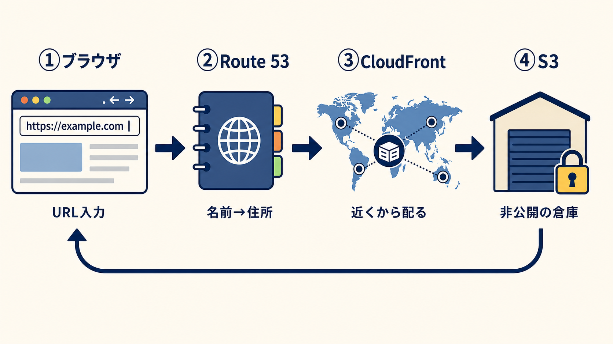

### 1-1. 名前を住所に変える(DNS / Route 53)

コンピュータ同士は名前(`example.com` のような**ドメイン**)では通信できない。必要なのは **IP アドレス**という数字の住所である。そこで通信の最初に必ず「名前→住所」の変換(**名前解決**)を行う。この仕組み全体が **DNS**。

ブラウザは DNS の電話帳の階層をたどり、最終的に「このドメインの正式な電話帳」である **Route 53**(AWS の DNS サービス)から「その名前は CloudFront のこの配信網です」という答えを得る。3〜4週目にやった「サブドメインの委任」は、この電話帳の管轄を渡す作業だった。

> **そのコード:** Route 53 の設定は AWS 側にあるためリポジトリには無いが、設定手順は `docs/DEPLOY.md` に記録してある。リポジトリ内で「名前の答えの行き先」を決めているのは CloudFront であり、その設定書類が次項以降に登場する。

### 1-2. 一番近い配達拠点につながる(CloudFront)

**CloudFront** は CDN——世界中に置かれた配達拠点(エッジ)の網。ブラウザは自動的に一番近い拠点(東京からなら東京)に **HTTPS**(暗号化通信。鍵マークのあれ)でつながり、「index.html をください」と頼む。拠点は手元の**写し(キャッシュ)があれば即返す**。なければ次へ。

CloudFront は返すファイル全部に「約束書き」(セキュリティヘッダー)を付ける。この約束書きの中身こそ、このアプリの根幹である。

> **そのコード:** `infra/cloudfront/response-headers-policy.json:19`
> ```json
> "ContentSecurityPolicy": "default-src 'none'; script-src 'self'; style-src 'self';
>   font-src 'self'; img-src 'self'; manifest-src 'self'; connect-src 'none'; ..."
> ```
> これが **CSP(コンテンツセキュリティポリシー)**=ブラウザへの命令書。読み方:
> - `default-src 'none'` — 原則、何も読み込むな
> - `script-src 'self'` — プログラムは**自分のサーバーのものだけ**許す(他所のプログラムは実行禁止)
> - `connect-src 'none'` — **外部への通信は全面禁止**。記録を外に送らないことを、アプリの善意でなくブラウザの強制力で保証する1行
>
> 同じファイルの `frame-ancestors 'none'`(他サイトへの埋め込み禁止)、`StrictTransportSecurity`(:25-30、HTTPS 強制)も全ファイルに付く。

### 1-3. 非公開の倉庫から取り寄せる(S3)

写しがなければ、拠点は大元の倉庫 **S3**(AWS のファイル置き場)へ取りに行く。S3 には完成品のファイル一式が置いてあるが、**S3 自体は非公開**で、世界の誰も直接読めない。読めるのは自分の CloudFront ただ1つ。

> **そのコード:** `infra/s3/bucket-policy.json:4-16`
> ```json
> "Sid": "AllowCloudFrontServicePrincipalReadOnly",
> "Effect": "Allow",
> "Principal": { "Service": "cloudfront.amazonaws.com" },
> "Action": "s3:GetObject",
> "Condition": { "StringEquals": { "AWS:SourceArn": "arn:aws:cloudfront::…:distribution/…" } }
> ```
> 読み方:「**許可**(Allow)するのは **CloudFront** (Principal)が**読むこと**(GetObject)だけ。ただし**うちの配信網から来た場合に限る**(Condition)」。これ以外の全アクセスは S3 の初期状態(全部拒否)のまま。S3 をうっかり公開して流出させる定番事故を、入口を1つに絞ることで塞いでいる。

もう1つ、ファイルの種類ごとに「写しをどれだけ使ってよいか」が違う。**index.html だけは「毎回、最新か確かめよ」**——ここが古いと、アプリを更新したのに利用者へ古い版が配られ続けるからである。

> **そのコード:** `.github/workflows/deploy-web.yml:39-53`(公開作業の手順書。場面12で全体を説明)
> ```yaml
> - name: Upload versioned assets        # フォント・JS・CSS は
>   run: aws s3 sync dist/ ... --cache-control "public, max-age=3600"   # 1時間写しでよい
> - name: Upload entry documents         # index.html だけは
>   run: aws s3 cp dist/index.html ... --cache-control "no-cache, must-revalidate"  # 毎回確かめよ
> - name: Upload icons                   # アイコンは
>   run: aws s3 sync ... --cache-control "public, max-age=86400"        # 1日写しでよい
> ```

### 1-4. ブラウザが組み立てる

ブラウザは届いた index.html を上から読み、「CSS が2枚要る」「プログラムが要る」と気づいて追加で要求する(同じ道を通って届く)。

> **そのコード:** `web/src/index.html:11-12, 37`
> ```html
> <link rel="stylesheet" href="./assets/styles.css">   ← 見た目の定義をくれ
> <link rel="stylesheet" href="./assets/fonts.css">    ← フォントの対応表をくれ
> ...
> <script type="module" src="./assets/app/main.js"></script>  ← プログラムを実行せよ
> ```

全部揃うと組み立てて表示する。何がどう組み立てられるのかは次の場面で。

---

## 場面2　最初の画面ができる —— 受け取ったファイルの正体(HTML・CSS・JavaScript)

**画面に見えること**:「かけら」のロゴ。そして初回だけ、画面全体にこの言葉。

> きれいだと思った。腹が立った。
> 消えてしまう前に、一日に一行、拾っておく。
> ［はじめる］

届いたファイルは3種類で、担当が違う。

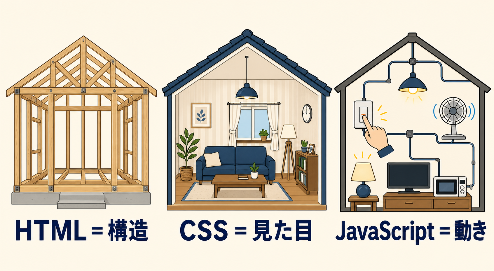

| 種類 | 担当 | 家で言うと | 書いてあること |
|---|---|---|---|
| **HTML** | 構造 | 骨組み | どこに何の部品があるか |
| **CSS** | 見た目 | 内装 | 色・書体・余白 |
| **JavaScript** | 動き | 配線と家電 | 押されたらどうするか |

分ける理由:**変わる理由がそれぞれ違う**から。文言を直すなら構造、色なら見た目、保存の仕方なら動き。混ぜると、色1つ直すのに動きの命令をかき分ける羽目になる。

### 2-1. HTML の中身は「空の箱4つ」だけ

> **そのコード:** `web/src/index.html:27-37`(これが本体のほぼ全部)
> ```html
> <main id="main">
>   <section id="today-view" aria-labelledby="today-title"></section>
>   <section id="outing-view" aria-labelledby="outing-title" hidden></section>
>   <section id="fragments-view" aria-labelledby="fragments-title" hidden></section>
>   <section id="about-view" aria-labelledby="about-title" hidden></section>
> </main>
> <div id="onboarding-view"></div>
> <div id="status" class="sr-only" role="status" aria-live="polite"></div>
> <script type="module" src="./assets/app/main.js"></script>
> ```

読み方(`<○○>〜</○○>` という**タグ**で部品を宣言する文法):

- `<section>` は「区画」。4画面(今日/ひとつ/かけら/about)に対応する**空の箱**
- `id="today-view"` は箱の名前。プログラムが「この名前の箱はどこ?」と探すときに使う
- `hidden` は「隠しておいて」。起動直後は「今日」の箱だけ見える
- `<div id="status" role="status">` は**目に見えない通知欄**。ここに文字を書くと、目の不自由な人が使う画面読み上げソフトが自動で読み上げる(場面4で使う)

骨組みには**変わらないもの(箱の配置)だけ**を書き、**変わるもの(箱の中身)はプログラムが作る**。今日の箱の中身は「もう書いたか」「初回か」で全く違うので、固定の HTML には書けない。

### 2-2. CSS の中身は「名前と値の対応表」だけ

> **そのコード:** `web/src/styles.css:8-20`(抜粋)
> ```css
> @theme {
>   --color-sushi: #eef1f1;   /* 地の色 */
>   --color-sumi: #333c40;    /* 本文の色(墨) */
>   --color-ai: #33566e;      /* 主色(藍) */
>   --color-seiji: #3e6b63;   /* 月に一度の外出専用(青磁) */
>   --color-kin: #85631f;     /* 60日開放の一度だけ(金) */
>   --font-mincho: "Zen Old Mincho", serif;      /* 記録の書体 */
>   --font-gothic: "Zen Kaku Gothic New", sans-serif;  /* 操作部品の書体 */
> }
> ```
> (`#333c40` は色の番号=カラーコード)

個々の部品の見た目は、HTML 側に**名前を書き添えて**指定する。

> **そのコード(使う側の例):** `web/src/index.html:15`
> ```html
> <body class="min-h-dvh overflow-x-hidden bg-sushi font-gothic text-sumi antialiased">
> ```
> 「背景は sushi、書体は gothic、文字色は sumi で」の意味。

この「名前で指定→あとで本物の CSS に変換」の流儀が **Tailwind CSS** という道具である(変換の話は場面11)。利点は対応表1か所を直せば全画面に効くこと。実際ダークモード対応は、**暗い環境用の対応表をもう1枚置いてあるだけ**で、各画面のコードは1文字も変えていない。

> **そのコード:** `web/src/styles.css:68-81`
> ```css
> @media (prefers-color-scheme: dark) {   /* 端末が「暗い表示」設定なら */
>   :root {
>     --color-sushi: #262b2c;   /* 地の色を夜用に差し替え */
>     --color-sumi: #e4e9ea;    /* 本文色を夜用に差し替え */
>     ...
>   }
> }
> ```

### 2-3. そもそも、どうやってプログラムは「動き出す」のか

ここが一番大事な配管の話なので、ゆっくりやる。**HTML の中の1行が、すべての始まり**である。

> **そのコード:** `web/src/index.html:37`
> ```html
> <script type="module" src="./assets/app/main.js"></script>
> ```

ブラウザは HTML を上から読んでいて、この行に出会うと「main.js というプログラムのファイルをください」とサーバーに追加要求する。届いたら、**そのファイルの中身を1行目から順に実行し始める**。人間がボタンを押したわけでも、何かを起動したわけでもない。**HTML にこの1行が書いてあるから、勝手に始まる。** これが唯一の入口である。

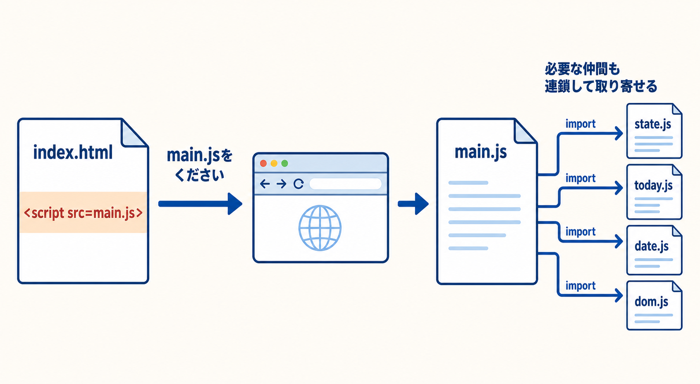

ところでプログラムは15ファイルに分かれている。main.js しか呼んでいないのに、他の14ファイルはどうやって動くのか。答は main.js の**冒頭7行**にある。

> **そのコード:** `web/src/app/main.js:1-7`
> ```js
> import { finishOnboarding, getState, initialize, subscribe } from "./state.js";
> import { dateKey } from "./lib/date.js";
> import { find, listen, setMarkup, setText } from "./lib/dom.js";
> import { renderFragments } from "./views/fragments.js";
> import { renderOnboarding } from "./views/onboarding.js";
> import { renderOuting, resetOutingTransient } from "./views/outing.js";
> import { renderToday, resetTodayTransient } from "./views/today.js";
> ```

`import { A } from "./B.js"` は「**B.js というファイルから、A という関数を借りてくる**」という命令である。ブラウザはこの行を見ると B.js も追加で取り寄せる。B.js の側は、貸してよいものに `export`(輸出)という印を付けてある(たとえば `state.js:31` の `export function saveEntry(...)`)。**export された関数だけが、他のファイルから借りられる。**

つまり:HTML が main.js を呼ぶ → main.js が import で仲間を呼ぶ → 仲間がさらに import で道具を呼ぶ(たとえば today.js の1行目は `import { markOutingWent, saveEntry } from "../state.js"`)。**連鎖的に15ファイル全部が読み込まれ、部屋どうしが廊下でつながる。** 「today.js が state.js の saveEntry を呼べる」のは、この import の廊下が最初に敷かれているからである。

### 2-4. プログラムが HTML の「箱」を掴む

読み込まれた main.js の実行が始まる。import の次に最初にやるのは、**HTML に置いてある空の箱を、プログラムの手で掴む**ことである。

> **そのコード:** `web/src/app/main.js:9-16`
> ```js
> const roots = {
>   today: document.querySelector("#today-view"),        // HTML の id="today-view" の箱を掴む
>   outing: document.querySelector("#outing-view"),      // id="outing-view" の箱
>   fragments: document.querySelector("#fragments-view"),
>   about: document.querySelector("#about-view"),
> };
> const statusRoot = document.querySelector("#status");        // 読み上げ用の通知欄
> const onboardingRoot = document.querySelector("#onboarding-view");
> ```

`document.querySelector("#today-view")` は「**いま表示している HTML の中から、id が today-view の部品を探して持ってきて**」というブラウザへの命令。`#` は「id で探す」という印である。場面2-1 の HTML に `<section id="today-view">` と書いておいたのは、**ここで掴んでもらうため**だった。HTML(構造)と JavaScript(動き)は、この **id という名前**で手をつなぐ。

掴んだ箱は `roots` という袋にまとめて入れてある。以後、プログラム内で `roots.today` と書けば「今日の画面の箱」を指せる。**「views/ の JS が画面を組み立てる」と言うとき、組み立てた HTML の流し込み先は、必ずこの掴んだ箱のどれか**である。

### 2-5. 「関数を呼ぶ」とはどういうことか — 司令塔が画面係に仕事を渡す瞬間

この文書では「render が renderToday を呼ぶ」のような言い方を何度もする。**呼ぶとは、材料を渡して仕事を依頼すること**である。実物を見る。

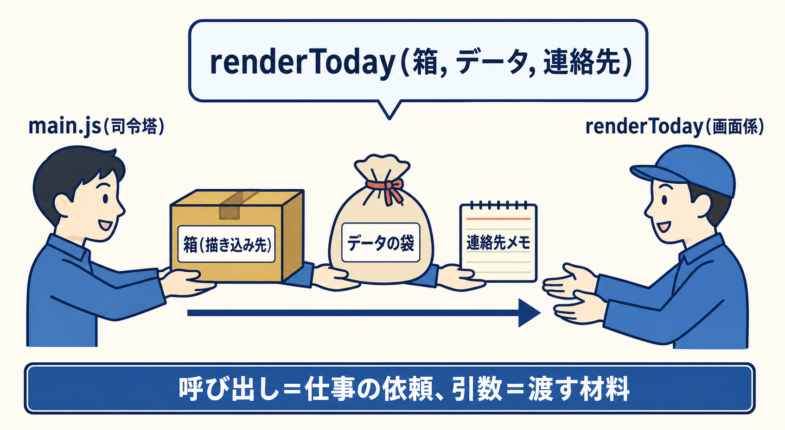

> **そのコード(依頼する側):** `web/src/app/main.js:44-49`(render 関数の中)
> ```js
> if (active === "today") {                       // いまの画面が「今日」なら
>   renderToday(roots.today, state, notify, {     // ← renderToday に仕事を依頼
>     allowAutofocus: !shouldShowOnboarding,
>     openFragments: () => navigate("fragments"),
>     openOuting: () => navigate("outing"),
>   });
> }
> ```
>
> **そのコード(依頼される側):** `web/src/app/views/today.js:116`
> ```js
> export function renderToday(root, state, notify, options) {
> ```

`renderToday(A, B, C, D)` と書くと、today.js の `renderToday` が実行され、**カッコの中の4つの材料(引数という)が、受け取り側の4つの名前に順番どおり入る**。対応表にするとこうなる。

| 渡す側(main.js)が入れたもの | 受け取る側(today.js)での名前 | 中身は何か |
|---|---|---|
| `roots.today` | `root` | 2-4 で掴んだ「今日の画面の箱」。**ここに描き込め**、という指定 |
| `state` | `state` | データの袋(今日の記録があるか等を、これを見て判断する) |
| `notify` | `notify` | 通知係の関数。**関数そのものも材料として渡せる**。画面係は中身を知らないまま `notify("記録を置きました")` と呼ぶだけでよい |
| `{ allowAutofocus: …, openFragments: …, … }` | `options` | 細かい指示の袋。「フォーカスしてよいか」「一覧を開きたくなったらこれを呼べ」 |

4つ目が特に大事で、**画面の切り替え(navigate)は司令塔の仕事**なので、画面係には「切り替えたくなったらこの関数を呼べ」という**連絡先だけ**を渡している。だから場面3で見るボタンの予約 `listen(..., options.openFragments)` は、「押されたら、司令塔からもらった連絡先に電話する」という意味になる。画面係は司令塔の内部を知らず、司令塔は画面の中身を知らない——**互いに渡された材料だけで仕事をする**。これが「越境しない」の実装である。

renderOuting・renderFragments も同じ形で呼ばれる(`main.js:50-59`)。**「〜という JS が画面を組み立てる」の正体は、毎回この「司令塔が、箱とデータと連絡先を渡して呼ぶ」である。**

### 2-6. main.js は156行あるのに、なぜ「末尾の4行」から動くように見えるのか

ここで疑問が湧くはずである。main.js には150行以上いろいろ書いてあるのに、なぜ「起動は `initialize()` から」なのか。その前の行は何なのか。

答:**ファイルは1行目から順に全部実行されている。** ただし途中の大部分は「**関数の定義**」——「このレシピをこの名前で棚に登録しておけ」という行——なので、実行しても**何も起きない**。実際に何かが動くのは定義でない行だけで、それが末尾に集まっている。上から分類するとこうなる。

> **そのコード:** `web/src/app/main.js` 全体の見取り図
> ```js
> // 1〜7行目: import(即実行。仲間のファイルを取り寄せて廊下をつなぐ)
> import { finishOnboarding, getState, initialize, subscribe } from "./state.js";
> ...
> // 9〜21行目: 道具の用意(即実行。HTML の箱を掴む、覚え書き用の変数を作る)
> const roots = { today: document.querySelector("#today-view"), ... };
> let active = "today";
>
> // 23〜125行目: レシピの登録(★定義だけ。中身はまだ1行も実行されない)
> function notify(message) { ... }      // 「notify というレシピはこれ」と棚に置くだけ
> function render() { ... }             // 同上
> function navigate(view) { ... }       // 同上
> ...
> // 127〜151行目: 予約を仕掛ける(即実行。ただし中の関数はイベントが起きるまで動かない)
> listen(window, "popstate", (event) => { ... });        // 「戻る」の見張り(場面5)
> listen(document, "visibilitychange", () => { ... });   // 日付またぎの見張り(場面6)
>
> // 153〜156行目: ここで初めて、棚のレシピを名指しで「作れ」と命じる
> initialize();
> history.replaceState(routeState("today"), "");
> subscribe(render);
> render();
> ```

`function 名前() { ... }` という書き方は「実行しろ」ではなく「**登録しろ**」という文である。124行目まで読み終えた時点では、レシピ帳が書き上がっただけで、コンロに火はついていない。`initialize()` のように**名前にカッコを付けて呼んだ瞬間**が、火のつく瞬間である。

順番が逆にできないことも分かる。`render()` を先頭に書いたら、その時点では render というレシピが未登録で、箱も掴んでいないので失敗する。**道具を揃え → レシピを全部登録し → 最後に「始めろ」と言う。** プログラムファイルの典型的な構成である。

### 2-7. 起動の4手

プログラムは役割ごとに部屋を分けた15ファイル(約1,000行)。

```
app/
├── main.js        司令塔。どの画面を出すか決め、切り替える
├── state.js       データの管理人。記録の袋を一手に持つ
├── storage/local.js  保存係。ブラウザへの読み書きはここだけ
├── views/         画面係(today.js / outing.js / fragments.js / about.js / onboarding.js)
└── lib/           道具箱(date.js=日付計算、dom.js=画面操作)
```

ルールは「**越境しない**」。画面係は保存しない(管理人に頼む)。管理人は画面を描かない(知らせるだけ)。保存係はデータの意味を知らない(言われた通り書くだけ)。

起動時、司令塔は4手を打つ。**この4行が本当にファイルの末尾にそのまま書いてある。**

> **そのコード:** `web/src/app/main.js:153-156`
> ```js
> initialize();                                  // ① 保存データを読み込む
> history.replaceState(routeState("today"), ""); // ② 「今日の画面にいる」と履歴に記す
> subscribe(render);                             // ③ 「データが変わったら描き直す」を予約
> render();                                      // ④ 最初の描画
> ```

①の中身は管理人 → 保存係と伝わる(コードは場面4の 4-3 で見る)。初日なので物置は空、まっさらな初期データが返る。

④の render は「初回(onboarded が false)なら、はじめの言葉をかぶせる」と判断する。

> **そのコード:** `web/src/app/main.js:41, 73` と `web/src/app/views/onboarding.js:4-9`
> ```js
> // main.js — 出すかどうかの判断
> const shouldShowOnboarding = (!state.onboarded && active !== "about") || onboardingOpen;
> ...
> if (shouldShowOnboarding) renderOnboarding(onboardingRoot, closeOnboarding, !state.onboarded);
> ```
> ```js
> // onboarding.js — 言葉そのものはプログラム内に直接書いてある
> setMarkup(root, `
>   <div class="fixed inset-0 ..." role="dialog" aria-modal="true" ...>
>     <p ...>きれいだと思った。<br>腹が立った。</p>
>     <p ...>消えてしまう前に、<br>一日に一行、拾っておく。</p>
>     <button type="button" data-close ...>はじめる</button>
> `);
> ```

［はじめる］を押すと `onboarded: true` の印が付き、以後は出ない。

> **そのコード:** `web/src/app/state.js:27-29`
> ```js
> export function finishOnboarding() {
>   commit({ ...value, onboarded: true });   // commit は場面4で説明する「心臓」
> }
> ```

---

## 場面3　画面を眺める —— 押す前に、画面がどう作られたかを見ておく

**画面に見えること**:日付、「心が動いたこと」の入力欄(カーソル入り)、［なし］、＋済・人、［記録する］、下に「これまでを見る/今月のひとつ」。

この画面は、画面係 today.js がいま組み立てたもの。組み立ては全画面共通の4手である。

**(1) 組み立てる** — HTML の文字列を作って箱に流し込む。

> **そのコード:** `web/src/app/views/today.js:61-91` が入力画面の HTML を文字列として組み立てる関数 `formMarkup`。それを流し込むのが `today.js:158`
> ```js
> setMarkup(root, formMarkup(shouldAutofocus, optionalOpen));
> ```
> `setMarkup` の正体は道具箱にある1行:`web/src/app/lib/dom.js:1-3`
> ```js
> export function setMarkup(node, markup) {
>   node.innerHTML = markup;   // 箱(node)の中身をこの HTML に丸ごと入れ替える
> }
> ```

**(2) 仕掛ける** — 各ボタンに「押されたらこの関数を実行」という**予約(リスナー)**を仕掛ける。プログラムはユーザーがいつ押すか知らないので、「このボタンで click という出来事(**イベント**)が起きたら、この命令のまとまり(**関数**)を実行して」とブラウザに頼んでおく。ブラウザは常に見張っていて、起きた瞬間に呼んでくれる。**このアプリの「動き」は全部この予約の集合でできている。**

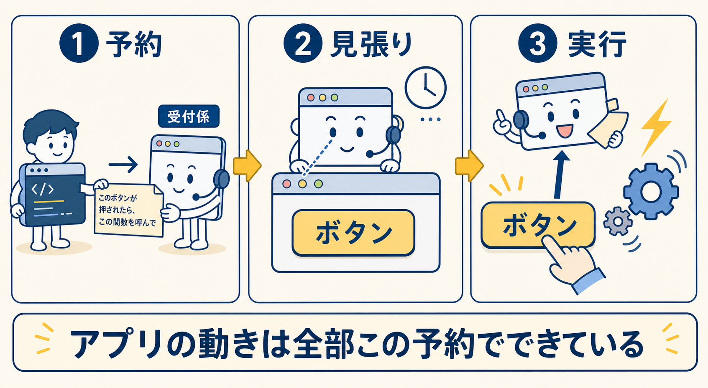

> **そのコード:** `web/src/app/views/today.js:171-185`(いま眺めている画面に仕掛かっている予約の実物)
> ```js
> listen(find(root, "[data-optional-toggle]"), "click", (event) => { ... }); // ＋済・人を開閉
> listen(find(root, "[data-none]"), "click", () => { ... });                 // なし(場面7)
> listen(find(root, "[data-fragments]"), "click", options.openFragments);    // これまでを見る
> listen(find(root, "[data-outing]"), "click", options.openOuting);          // 今月のひとつ(場面5)
> listen(form, "submit", (event) => { ... });                                // 記録する(場面4)
> ```
> `listen` も道具箱の言い換え:`web/src/app/lib/dom.js:13-15`
> ```js
> export function listen(node, event, handler) {
>   node.addEventListener(event, handler);   // ブラウザ標準の「予約」命令
> }
> ```

**(3) 自動フォーカス(1日1回だけ)** — 初回はカーソルを入力欄に入れるが、同じ日の2回目からは入れない。スマホではフォーカスのたびキーボードがせり上がって画面を覆うから。

> **そのコード:** `web/src/app/views/today.js:156, 161-166`
> ```js
> const shouldAutofocus = options.allowAutofocus && !entry && autofocusDate !== today;
> // 「許可されている && まだ書いてない && 今日はまだフォーカスしてない」ときだけ
> if (shouldAutofocus) {
>   autofocusDate = today;                    // 「今日はもうやった」と控える
>   requestAnimationFrame(() => {
>     if (form.elements.feeling.isConnected) form.elements.feeling.focus();
>   });
> }
> ```

---

## 場面4　一行書いて「記録する」を押す —— このアプリの心臓部、0.1秒の一本道

**画面に見えること**:「セミが鳴きやんで、静かすぎた」と書いて押すと、入力欄が消え、一行が**カードになってそっと降りてくる**。下に今日の短い一言がゆっくり浮かぶ。

裏では5ステップの一本道が走った。**全ステップ、コードで追う。**

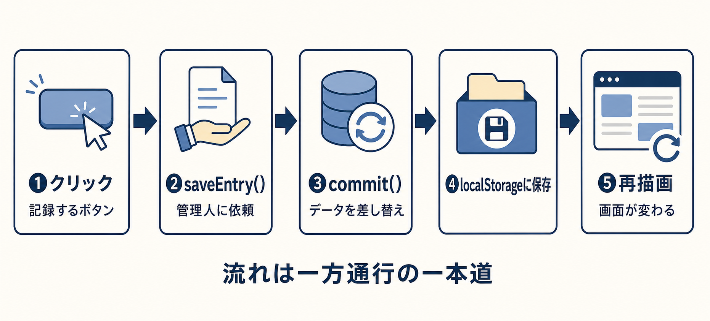

### 4-1. クリックが関数に届く

場面3(2)で仕掛けた予約をブラウザが思い出し、関数を実行する。

> **そのコード:** `web/src/app/views/today.js:185-202`(丸ごと)
> ```js
> listen(form, "submit", (event) => {
>   event.preventDefault();                                  // (a)
>   const fields = Object.fromEntries(new FormData(form));   // (b)
>   if (!fields.feeling.trim()) {                            // (c)
>     setText(find(root, "[data-error]"), "一行だけ書くか、「なし」を押してください");
>     form.elements.feeling.focus();
>     return;
>   }
>   editing = false;                                         // (d)
>   justSaved = true;
>   savedAnimated = false;
>   ...
>   saveEntry(fields, today);                                // (e)
>   notify("記録を置きました");                               // (f)
> });
> ```

1行ずつ:

- **(a)** 「ブラウザの標準動作を止めて」。ブラウザは1990年代から「送信ボタン=入力内容をサーバーへ送ってページを読み込み直す」という標準動作を持つ。止め忘れるとページごと再読み込みされ画面が消し飛ぶ
- **(b)** 入力欄の中身を全部取り出し、`fields` という名前の袋に詰める。袋(**オブジェクト**)の中身:`{ feeling: "セミが鳴きやんで、静かすぎた", done: "", person: "" }`。`const fields =` は袋に名前を付ける書き方(**変数**)
- **(c)** もし(`if`)一行目が空なら、エラー文を出してカーソルを戻し打ち切り(`return`)。`trim()` は前後の空白を削るので、スペースだけも空と判定
- **(d)** 画面係の覚え書き。「編集中でない」「たった今保存した」。4-4 の演出で使う
- **(e)** **画面係は自分では保存しない。** 管理人の関数 `saveEntry` に袋を渡して頼むだけ
- **(f)** 目に見えない通知欄(場面2の `#status`)に文を書く関数。読み上げソフトがこれを読み上げる

> **notify のコード:** `web/src/app/main.js:23-26`
> ```js
> function notify(message) {
>   setText(statusRoot, "");                                  // 一度空にしてから
>   requestAnimationFrame(() => setText(statusRoot, message)); // 書き直す
> }
> ```
> 一度空にするのは、同じ文を2回続けて入れると読み上げソフトが「変化なし」とみなして黙るため。

### 4-2. 管理人がデータを書き換える

管理人(state.js)は `value` という名前で全データを**1つの袋**として持つ。

> **そのコード(袋の形):** 初期状態は `web/src/app/storage/local.js:3-11` に定義
> ```js
> function emptyState() {
>   return {
>     version: 1,          // データ形式の版番号
>     started_on: null,    // 初めて書いた日(まだ無い)
>     onboarded: false,    // はじめの言葉を読んだか
>     entries: {},         // ★日々の記録。「日付 → 記録」の対応表
>     outings: {},         // 月ごとの外出
>   };
> }
> ```

`entries` は**日付そのものが見出しの対応表**。同じ日付の見出しは1つしか持てないので、「1日1件」が**データの形で強制**される。2件目を入れる方法が構造上ない。

> **そのコード(saveEntry):** `web/src/app/state.js:31-47`
> ```js
> export function saveEntry(fields, today = dateKey()) {
>   const feeling = fields.feeling.trim();
>   if (!feeling) return false;               // 念のためもう一度、空を拒否
>   const previous = value.entries[today];    // 今日の既存記録(書き直しの場合)
>   const entry = {
>     feeling,
>     done: fields.done.trim(),
>     person: fields.person.trim(),
>     created_at: previous?.created_at ?? new Date().toISOString(),
>     // ↑ 書き直しでも「最初に書いた時刻」を引き継ぐ(?? は「左が無ければ右」)
>   };
>   commit({
>     ...value,                                      // いまの袋を全部コピーして
>     started_on: value.started_on ?? today,         // 初日が未記録なら今日を初日に
>     entries: { ...value.entries, [today]: entry }, // 今日の欄だけ差し替える
>   });
>   return true;
> }
> ```

`...value` は「袋の中身をここに全部展開する」記法。つまり**いまの袋を丸ごとコピーし、今日の欄だけ新しくした"新品の袋"を作って** commit に渡す。元の袋は直接いじらない。直接いじる方式は「いつの間にか中身が変わっていた」を許すが、新品交換方式なら**変化が起きる場所が commit の一点に限られる**。

その commit がこれ。**全部の書き換えが必ずここを通る、このアプリの心臓。**

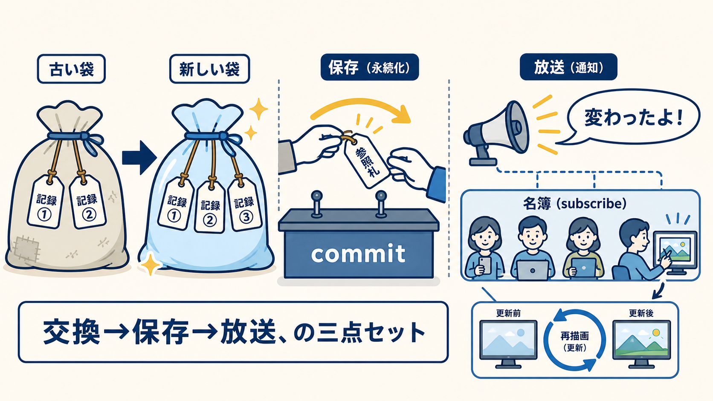

> **そのコード:** `web/src/app/state.js:7-11`
> ```js
> function commit(next) {
>   value = next;                                    // ① 袋を新品に交換
>   save(value);                                     // ② 保存係に書き込ませる
>   subscribers.forEach((subscriber) => subscriber(value)); // ③ 予約者全員に「変わったよ」と放送
> }
> ```

### 4-3. 保存係がブラウザの物置に書き込む

②の `save` の中身。

> **そのコード:** `web/src/app/storage/local.js:1, 37-39`
> ```js
> const KEY = "kakera.state.v1";           // 物置の棚の名前
>
> export function save(value) {
>   localStorage.setItem(KEY, JSON.stringify(normalize(value)));
> }
> ```

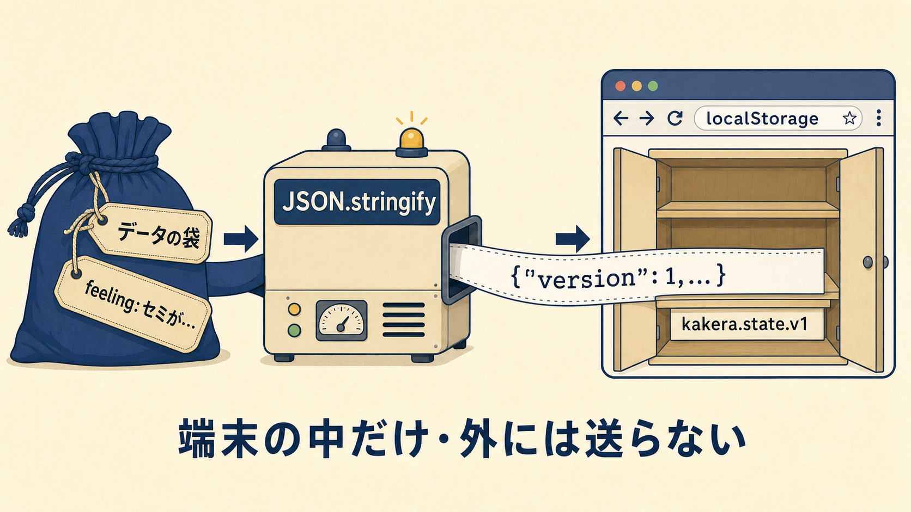

- **localStorage** — ブラウザが各サイト用に用意する小さな物置。①閉じても消えない ②他サイトから読めない ③**その端末のそのブラウザにしかない**(③が弱点。保険が場面9の「控え」)
- **JSON.stringify** — 袋を1本の文字列(`{"version":1,"entries":{...}}`)に変換する命令。物置には文字列しか置けない

ちなみに起動時(場面2の①)の読み出しも同じファイルにあり、**疑い深く**書かれている。

> **そのコード:** `web/src/app/storage/local.js:28-35`
> ```js
> export function load() {
>   try {
>     const stored = localStorage.getItem(KEY);
>     return stored ? normalize(JSON.parse(stored)) : emptyState();
>   } catch {
>     return emptyState();   // 壊れていても、まっさらな状態で必ず起動する
>   }
> }
> ```
> `try { } catch { }` は「試して、失敗したらこちら」という構文。保存データが壊れていても(手でいじられた・別版だった)、**アプリは絶対に起動に失敗しない**。

**ここまでで、サーバーとの通信は一度も起きていない。** 通信する命令がどこにも書かれていない上、書かれていても場面1-2 の CSP(`connect-src 'none'`)が遮断する。

### 4-4. 放送を受けて、画面が作り直される

③の放送を受け取るのは、起動4手の③(`main.js:155` の `subscribe(render)`)で入れた予約である。

> **そのコード(予約の受け付け側):** `web/src/app/state.js:5, 22-25`
> ```js
> const subscribers = new Set();           // 予約者の名簿
> export function subscribe(subscriber) {
>   subscribers.add(subscriber);           // 名簿に載せる(render がここに載っている)
> }
> ```

commit の③が名簿の全員を呼ぶ → `render()`(main.js:39-75)が実行される → いまの画面は「今日」なので、**場面2-5 で見たあの呼び出し**(`renderToday(roots.today, state, notify, {...})` — 箱・データの袋・連絡先を渡す)がもう一度実行される。renderToday は毎回ゼロから組み立て直し、今回は渡された袋の中に「今日の記録」が入っているので、入力フォームではなく**記録カードの画面**を作る。

> **そのコード:** `web/src/app/views/today.js:120-134`(抜粋)
> ```js
> if (entry && !editing) {                          // 記録があって編集中でないなら
>   setMarkup(root, savedMarkup(contextMarkup, justSaved, unlockNoticeVisible)); // ①骨組み
>   setText(find(root, "[data-feeling]"), entry.feeling);                        // ②文字を埋める
>   ...
>   if (justSaved) renderDailyLine(find(root, "[data-line]"), today, !savedAnimated); // ③一言
>   if (!savedAnimated && justSaved) {
>     find(root, "[data-edit-card]").classList.add("animate-settle", ...);       // ④降りる演出
>   }
> ```

①と②が分かれているのは**セキュリティのため**。ユーザーの文字を①の骨組みに直接混ぜると、`<script>…` のような文字列を書き込まれたときに**プログラムとして実行されてしまう**(XSS という古典的攻撃)。②の `setText` を通すと何を書かれても「ただの文字」扱いになる。

> **そのコード:** `web/src/app/lib/dom.js:17-19`
> ```js
> export function setText(node, value) {
>   node.textContent = value ?? "";   // textContent = 文字としてしか解釈しない入れ口
> }
> ```

③の「今日の一言」は366日ぶんの文からその日のものを1つ出す。**保存直後(justSaved)の一度しか出ない**——①の条件式に `justSaved` が入っているのがその実装である。④の演出の定義は CSS 側にある。

> **そのコード:** `web/src/styles.css:38, 41-44`
> ```css
> --animate-settle: settle 0.4s cubic-bezier(.16,.84,.44,1);
> @keyframes settle {
>   from { opacity: 0; transform: translateY(-0.5rem); }  /* 透明で少し上から */
>   to   { opacity: 1; transform: translateY(0); }        /* 0.4秒かけて定位置へ */
> }
> ```

### 4-5. まとめ:0.1秒間の全登場人物と、その居場所

```
ユーザーが［記録する］を押す
  ▼ ブラウザが submit イベントを検知、予約された関数を実行
today.js:185   ① 標準動作を止め、入力を袋に詰め、空チェックし、管理人に依頼
  ▼
state.js:31    ② 新品の袋を作り、commit(state.js:7)で交換
  │              ├─▶ local.js:37 ③ 袋を文字列にして localStorage の棚へ
  │              └─▶ 名簿(state.js:5)の全員に放送
  ▼
main.js:39     ④ render() 実行
  ▼
today.js:120   ⑤ カード画面をゼロから組み立て、文字を安全に埋め、演出を付ける
  ▼
画面が変わる(main.js:23 の notify が読み上げソフトに「記録を置きました」)
```

**流れは常にこの一方通行**で、逆流(画面が勝手にデータを触る道)は存在しない。おかしくなったら、この一本道を上から調べれば必ず原因に行き着く。

---

## 場面5　「今月のひとつ」を開く —— ページを移動していないのに画面が替わる

**画面に見えること**:一瞬で外出の画面へ。「今月、行ってみる場所をひとつ。行く途中で気になる場所を見つけたら、そちらに変えてもかまいません。」

場面2の伏線——空の箱4つ——の回収である。

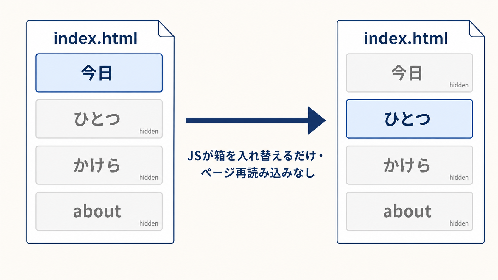

普通のサイトは1画面=1 HTML で、リンクのたびサーバーから次ページをもらい読み込み直す。このアプリは HTML が1枚。押した瞬間に起きるのは「箱の入れ替え」だけである。

> **そのコード(押した瞬間に走る関数):** `web/src/app/main.js:77-90`
> ```js
> async function navigate(view) {
>   if (view === "about" && !aboutRenderer) {
>     ({ renderAbout: aboutRenderer } = await import("./views/about.js"));
>     // about 画面だけ、初めて必要になった瞬間に取り寄せる(毎日の起動を軽くするため)
>   }
>   ...
>   active = view;                          // 「いまの画面」を差し替え
>   history.pushState(routeState(view), ""); // ★履歴に「1ページ進んだこと」を手で記録
>   render();                                // 描き直し
>   find(roots[view], "h1")?.focus({ preventScroll: true });  // 見出しにフォーカス(読み上げ対応)
>   scrollTo({ top: 0, behavior: "auto" });  // ページ先頭へ
> }
> ```
>
> render の中で箱の表示/非表示を入れ替えるのがこれ:`main.js:32-37`
> ```js
> function setActive(view) {
>   active = Object.hasOwn(roots, view) ? view : "today";
>   Object.entries(roots).forEach(([name, root]) => {
>     root.hidden = name !== active;   // いまの画面以外、全部の箱に hidden を付ける
>   });
> }
> ```

**紙芝居の枠は1つ、絵だけ差し替える。** 通信ゼロなので一瞬。この方式が SPA(シングルページアプリ)。理由は①読み込み直しの待ちと白画面を避ける、②データが端末内にあるのでページを分けても損しかない、③一度開けば機内モードでも動く。

ただしタダではない。ブラウザから見ると「ずっと同じ1ページ」なので、放っておくと**スマホの「戻る」でサイトから出てしまう**。上のコードの★行 `history.pushState` が「1ページ進んだことにする」偽装で、さらに「戻るが押された」イベントにも予約がある。

> **そのコード:** `web/src/app/main.js:127-140`
> ```js
> listen(window, "popstate", (event) => {          // popstate =「戻る/進む」が押された
>   const view = event.state?.kakera ? event.state.view : "today";
>   ...
>   active = Object.hasOwn(roots, view) ? view : "today";
>   render();                                       // 前の画面を描き直す
>   scrollTo({ top: 0, behavior: "auto" });
> });
> ```

マルチページならブラウザが無料でやることを、この約20行で肩代わりしている——速さと引き換えの数少ないコスト。

ユーザーは「銭湯に入る」と書いて決めた。保存は場面4と同じ一本道で、管理人の窓口が変わるだけ。

> **そのコード:** `web/src/app/state.js:49-61`
> ```js
> export function saveOuting(fields, month = monthKey()) {
>   const goal = fields.goal.trim();
>   if (!goal) return false;
>   const outing = {
>     goal,
>     planned_on: fields.planned_on || null,   // 予定日は決めなくてもよい(null)
>     went_on: previous?.went_on ?? null,      // 行った日(まだ null)
>     ...
>   };
>   commit({ ...value, outings: { ...value.outings, [month]: outing } });
> }                                    //  ↑ 見出しは "2026-08"。月にひとつしか持てない
> ```

---

# 第二部　二日目からの日々

## 場面6　翌朝、開きっぱなしのアプリを見る —— 日付またぎの見張り番

**画面に見えること**:昨日のカード……ではなく、ちゃんと新しい「今日」の入力画面。

SPA はページを読み込み直さないので、放っておけば**何日でも昨日の画面のまま**になる。それを防ぐ見張りが司令塔にいる。

> **そのコード:** `web/src/app/main.js:142-151`
> ```js
> listen(document, "visibilitychange", () => {     // 画面が隠れた/再び見えた、のイベント
>   if (document.visibilityState === "visible" && renderedDate !== dateKey()) {
>     // 再び見えた && 描いたときの日付(renderedDate)と今日(dateKey())が違うなら
>     renderedDate = dateKey();
>     active = "today";                            // 今日の画面に戻して
>     ...
>     render();                                    // 描き直す
>   }
> });
> ```

「今日は何日か」を作る `dateKey` は、日付計算専門の道具箱にある。日付計算は最も事故が多い領域(月末・うるう年・時差)なので、**計算はこのファイルに集約し、他のファイルには計算させない**。

> **そのコード:** `web/src/app/lib/date.js:3-8`
> ```js
> export function dateKey(date = new Date()) {   // new Date() = 端末の時計の「いま」
>   const year = date.getFullYear();
>   const month = String(date.getMonth() + 1).padStart(2, "0");
>   const day = String(date.getDate()).padStart(2, "0");
>   return `${year}-${month}-${day}`;            // "2026-08-02" の形にして返す
> }
> ```

## 場面7　何もなかった日 —— 「なし」ボタンの3行

**画面に見えること**:［なし］を押すと、「なし」という一行のカードが普通の記録と同じ姿で置かれる。

> **そのコード:** `web/src/app/views/today.js:179-182`
> ```js
> listen(find(root, "[data-none]"), "click", () => {
>   form.elements.feeling.value = "なし";   // 入力欄に「なし」と自動で書き込んで
>   form.requestSubmit();                   // 記録ボタンを押したのと同じ処理を呼ぶ
> });                                       // → 場面4の一本道がそのまま走る
> ```

たった3行だが、このアプリの思想が一番出ている3行でもある。「なし」は空白ではなく**「なしと確かめた」という立派な記録**として、他の日と同じ扱いで保存される。

なお同じ日のうちは「書き直す」で何度でも直せるが、**翌日からは直せない**。編集画面を開くコードが「今日の記録」しか対象にしないからである(`today.js:117-120` で `state.entries[today]`——**今日の欄だけ**——を見ている)。過去は自然に確定していく。

## 場面8　外出の日 —— 「行った」の1タップ

**画面に見えること**:今日の記録カードの下に「◇ 銭湯に入る ［行った］」。押すとボタンが消え、「行った日を置きました」。

> **そのコード(押した側):** `web/src/app/views/today.js:144-148`
> ```js
> const wentButton = find(root, "[data-went]");
> if (wentButton) listen(wentButton, "click", () => {
>   markOutingWent(monthKey(), today);      // 管理人に「今日行った」と伝える
>   notify("行った日を置きました");
> });
> ```
> **そのコード(管理人側):** `web/src/app/state.js:63-71`
> ```js
> export function markOutingWent(month = monthKey(), today = dateKey()) {
>   const outing = value.outings[month];
>   if (!outing?.goal || outing.went_on) return false;  // 目的が無い/もう行った → 何もしない
>   commit({
>     ...value,
>     outings: { ...value.outings, [month]: { ...outing, went_on: today } },
>   });                                                  // 行った日を刻んで、例の一本道へ
> }
> ```

特徴的なのは**押さなかった場合に何も起きない**こと。行かなかった月を数える・表示する・振り返らせるコードは、探しても**どこにも存在しない**(仕様書 `docs/REQUIREMENTS.md` の NG-9 で「作らない」と明記)。データには `went_on: null` が残るだけで、それを集計する画面がない。

## 場面9　「このアプリについて」—— 控え(バックアップ)と、やめる自由

**画面に見えること**:「控えを取る」を押すと `kakera-2026-08-09.json` がダウンロードされる。

記録は**この端末のこのブラウザにしかない**(場面4-3)。端末が壊れれば消える。その保険が「控え」で、全記録を1ファイル(JSON=人にも機械にも読めるテキスト形式)として端末に保存する。

> **そのコード:** `web/src/app/views/about.js` 冒頭の backup 関数と、道具箱のダウンロード関数 `web/src/app/lib/dom.js:21-28`
> ```js
> // about.js — 袋を整形してファイルにする
> function backup(state) {
>   downloadFile(`kakera-${dateKey()}.json`, "application/json",
>     `${JSON.stringify(state, null, 2)}\n`);
> }
> // dom.js — ブラウザ内でファイルを作り、ダウンロードさせる(通信ゼロ)
> export function downloadFile(name, type, content) {
>   const url = URL.createObjectURL(new Blob([content], { type }));
>   const anchor = document.createElement("a");
>   anchor.href = url;
>   anchor.download = name;
>   anchor.click();                    // 見えないリンクを作って自動クリック
>   URL.revokeObjectURL(url);
> }
> ```

対になる「控えから復元する」は、**無条件には信じない**。中身が正しい形か全項目検査し、1つでもおかしければ断って既存の記録に指一本触れない。

> **そのコード:** `web/src/app/views/about.js` の `validBackup` 関数(抜粋)
> ```js
> function validBackup(data) {
>   if (!data || data.version !== 1 || typeof data !== "object") return false;
>   const date = /^\d{4}-\d{2}-\d{2}$/;      // 「日付らしい形」の定義(正規表現)
>   ...
>   const entriesValid = Object.entries(data.entries).every(([key, entry]) => (
>     date.test(key)                          // 見出しは日付の形か
>     && typeof entry.feeling === "string"    // 一行は文字か
>     && entry.feeling.length > 0 && entry.feeling.length <= 140   // 文字数は上限内か
>     && ...
>   ));
>   return entriesValid && outingsValid && ...;
> }
> ```
> 復元本体は管理人にあり、**いま端末にある記録を優先**して合成する:`web/src/app/state.js:73-82`
> ```js
> export function restoreBackup(data) {
>   const restored = {
>     ...value,
>     entries: { ...data.entries, ...value.entries },   // 同じ日は端末側(value)が勝つ
>     outings: { ...data.outings, ...value.outings },   // (後に書いた方が上書きする記法)
>   };
>   commit(restored);
> }
> ```
> 復元操作で今日書いたぶんが消える事故を防いでいる。

同じ画面の「使うのをやめる」は3段階(申し出る → **控えを取ってから進むか選ぶ** → 最終確認して消す)。最後に呼ばれるのは管理人の `clearAll`(`state.js:84-92`)で、袋を初期状態に戻す commit を打つだけ——**消すのも例の一本道**である。

## 場面10　60日目 —— 金色の「読み返せます」

**画面に見えること**:いつも通り一行書いただけなのに、カードの下に見たことのない金色の一行——「読み返せます」。

一覧(「かけら」画面)は最初の60日間、**直近7日ぶんしか表示しない**。切り替えの判定はこの2行である。

> **そのコード(判定):** `web/src/app/lib/date.js:40-42`
> ```js
> export function isUnlocked(startedOn, today = dateKey()) {
>   return Boolean(startedOn) && daysBetween(startedOn, today) >= 60;
> }  // started_on(場面4-2で刻んだ「初めて書いた日」)から60日経ったか
> ```
> **そのコード(使う側):** `web/src/app/views/fragments.js:28-29`
> ```js
> const unlocked = isUnlocked(state.started_on);
> const keys = unlocked ? allDateKeys(state.started_on) : recentDateKeys();
> //            60日後: 初日から全部の日付   60日前: 直近7日の日付だけ
> ```
> 表示する日付の一覧(keys)を最初に絞ってしまうので、**8日より前の記録は、画面の組み立てに最初から登場しない**。

なぜ隠すか。書いてすぐ読み返せると記録は評価の対象になる(今日のは短い、昨日より薄い)。二か月寝かせてから読むと、一行が「二か月前の自分の断片」になっている。**寝かせることが機能。**

60日目のその日、記録を置いた直後に**一度だけ**金色の知らせが出る。「一度だけ」の実装:

> **そのコード:** `web/src/app/views/today.js:196-199`(保存処理の中)と `93-107`
> ```js
> unlockNoticeVisible = Boolean(state.started_on)
>   && daysBetween(state.started_on, today) === 60   // ちょうど60日目で
>   && !unlockAlreadyShown(today);                   // 今日まだ見せていないときだけ
> if (unlockNoticeVisible) rememberUnlockShown(today);
>
> // 「見せた」の控えは sessionStorage(ブラウザを閉じると消える一時置き場)へ
> function rememberUnlockShown(today) {
>   sessionStorage.setItem("kakera.unlock-shown-on", today);
> }
> ```
> `=== 60`(ちょうど)なので61日目からは出ない。特別は一度だから特別である。

開放後の一覧には、全記録をテキストに書き出すボタンも現れる(`fragments.js:64-69`)。中身は場面9と同じ `downloadFile`——これも通信ゼロ。

---

# 第三部　画面の外側 —— 作る側で起きていること

## 場面11　公開の前日 —— ビルド(材料を完成品に組み立てる)

リポジトリのファイルは役割で3つに分かれる。

| 種類 | 場所 | サーバーに上げる? |
|---|---|---|
| ① 材料(人間が書いたもの) | `web/src/` | 上げない |
| ② 完成品(機械が組み立てたもの) | `web/dist/` | **これだけ上げる** |
| ③ 道具・書類(組み立て機・仕様書・AWS設定) | `web/scripts/` `docs/` `infra/` | 上げない |

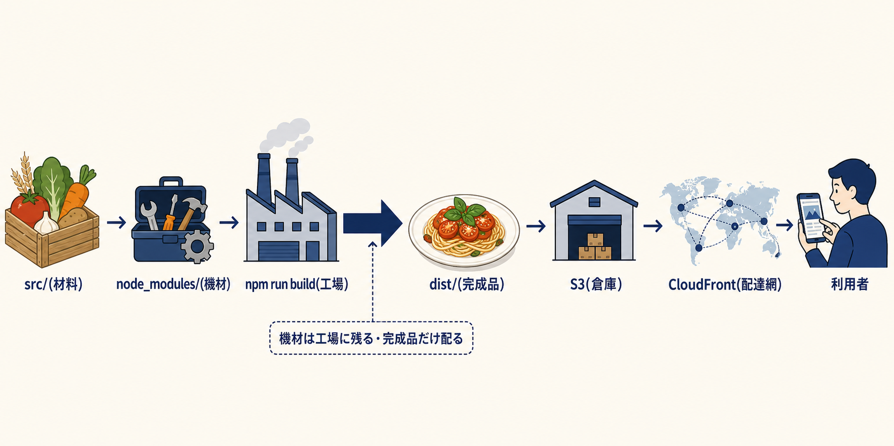

`npm run build` と打つと組み立て機が動く。この命令の定義と、組み立て機の実体:

> **そのコード:** `web/package.json:7-9` と `web/scripts/build.js`(159行)
> ```json
> "scripts": { "build": "node scripts/build.js" }
> ```
> ```js
> // build.js 冒頭(:13-17) — まず完成品置き場を全消去し、材料をコピー
> await rm(dist, { recursive: true, force: true });   // 毎回ゼロから作り直す
> await cp(resolve(src, "index.html"), resolve(dist, "index.html"));
> await cp(resolve(src, "app"), resolve(dist, "assets/app"), { recursive: true });
> await cp(resolve(root, "public"), dist, { recursive: true });
> ```

### なぜ Tailwind を「ビルドして」公開したのか

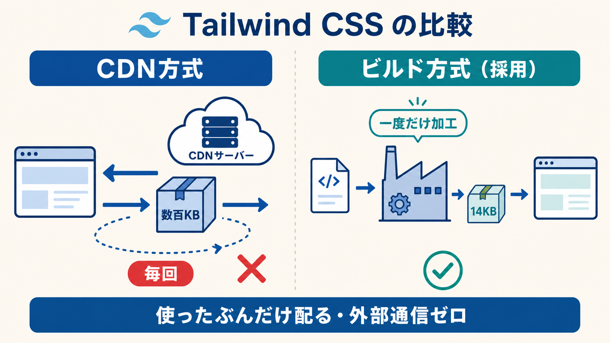

場面2-2 の「名前で指定→本物の CSS に変換」の**変換をいつどこでやるか**に2つの流儀がある。

**CDN 方式** — HTML に `<script src="https://cdn.tailwindcss.com">` と書く。**利用者がページを開くたび**、Tailwind 本体(数百KB)を外部の配布サーバー(CDN)から取り寄せ、利用者のブラウザ上で毎回変換させる。

**ビルド方式(採用)** — 公開前に開発者の手元で一度だけ変換し、**できあがった CSS だけ**を配る。

| | CDN 方式 | ビルド方式(採用) |
|---|---|---|
| 変換する場所 | 利用者のブラウザで毎回 | 開発者の手元で一度だけ |
| 届くもの | Tailwind 本体まるごと(数百KB) | 使ったぶんの CSS(**約14KB**) |
| 外部通信 | 毎回発生 | ゼロ |
| CDN 障害時 | 見た目が崩壊 | 無関係 |
| 公式の見解 | 「開発用。本番で使うな」 | 正式な本番の方法 |

> **そのコード(ビルド時の変換):** `web/scripts/build.js:149-158`
> ```js
> await run(
>   resolve(root, "node_modules/.bin/tailwindcss"),          // Tailwind の変換機を
>   ["-i", resolve(src, "styles.css"), "-o", tailwindCssPath, "--minify"],  // 一度だけ実行
> );
> const tailwindCss = await readFile(tailwindCssPath, "utf8");
> if (Buffer.byteLength(tailwindCss) > 20 * 1024) {
>   throw new Error(`Tailwind CSS exceeds 20 KB: ...`);      // 20KB を超えたらビルド失敗
> }
> ```
> 最後の3行は面白い仕掛けで、**CSS が20KBを超えたら組み立て自体を失敗させる**。「このアプリの見た目は20KBで表現しきれる規模を保つ」という約束を、人間の注意力でなく機械の検査にしてある。
>
> 「実際に使われた名前のぶんだけ生成する」ための指定は材料側にある:`web/src/styles.css:3-4`
> ```css
> @source "./index.html";      /* この2か所を読んで、 */
> @source "./app/**/*.js";     /* 登場した名前だけ CSS にせよ */
> ```

決定打はもう1つある。場面1-2 で見た CSP の `connect-src 'none'`(外部通信の全面禁止)の下では、**CDN へ取りに行く通信自体が遮断される**。このアプリでは CDN 方式は不利どころか動かない。ビルド方式は必然だった。

### node_modules を上げない理由

ビルドに使う部品の実体は `node_modules/` に入る——数万ファイル。これは**工場の機材であって、製品ではない**。

> **そのコード(取り寄せる部品の一覧):** `web/package.json:11-16`
> ```json
> "devDependencies": {
>   "@fontsource/zen-kaku-gothic-new": "^5.3.0",   // フォント
>   "@fontsource/zen-old-mincho": "^5.3.0",        // フォント
>   "@tailwindcss/cli": "^4.3.3",                  // Tailwind の変換機
>   "tailwindcss": "^4.3.3"
> }
> ```
> 全部が `devDependencies`(**開発時だけ使う部品**)の欄にある。つまり**完成品は他人のプログラムを1行も含まない**。ブラウザで動くのはこのリポジトリに書いた約1,000行だけ。
>
> **そのコード(上げない・Git にも入れない設定):** `.gitignore`
> ```
> node_modules/
> dist/
> ```
> 理由:`package-lock.json`(取り寄せた部品の正確な型番リスト)から `npm ci` で**いつでも寸分違わず再現できる**。再現できるものは保存しない。

完成品に入るのは機材の**成果物だけ**——生成済み CSS 14KB と、フォントも**実際に使うファイルだけ**を選んでコピーしている(`build.js:37-45` が、CSS から参照されているフォントファイル名を抜き出して、それだけを `dist/fonts/` へ運ぶ)。

## 場面12　公開の日 —— push しただけで世界に届くまで

開発者がやること:コードの変更を GitHub(コード置き場)の main ブランチに送る(push)。それだけ。あとは GitHub のサーバーが、リポジトリに置いた手順書どおり自動で動く。

> **そのコード(手順書全体):** `.github/workflows/deploy-web.yml`
> ```yaml
> on:
>   push:
>     branches: [main]          # main に push されたら発動
>     paths: ["web/**", ".github/workflows/deploy-web.yml"]  # web が変わったときだけ
> steps:
>   - run: npm ci               # ① 部品を型番リスト通りに取り寄せ
>   - run: npm run build        # ② 場面11の組み立て機を実行
>   - name: Upload versioned assets     # ③ 完成品を S3 へ同期(キャッシュ指定は場面1-3)
>     run: aws s3 sync dist/ s3://${{ vars.S3_BUCKET }}/ --delete ...
>   - name: Invalidate CloudFront       # ④ 世界中の拠点の古い写しを掃除
>     run: aws cloudfront create-invalidation --paths "/*"
> ```

このとき **AWS のパスワードや鍵はどこにも保存していない**。GitHub と AWS が互いに身元確認し、実行のたびに数分だけ有効な通行証を発行する仕組み(OIDC)を使う。

> **そのコード:** `.github/workflows/deploy-web.yml:12-14, 35-38`
> ```yaml
> permissions:
>   id-token: write             # 「身元証明書を発行してよい」という宣言
> ...
> - uses: aws-actions/configure-aws-credentials@v4
>   with:
>     role-to-assume: ${{ secrets.AWS_DEPLOY_ROLE_ARN }}   # この役を名乗らせてもらう
> ```
> AWS 側で「名乗ってよいのは誰か」「名乗ったら何ができるか」を絞る書類が
> `infra/iam/deploy-role-trust.json`(**このリポジトリの main ブランチからだけ**許す)と
> `infra/iam/deploy-role-policy.json`(できるのは**この倉庫への書き込みと写しの掃除だけ**)。
> 長生きする鍵はいつか漏れる。だから最初から作らない。

数分後、世界のどこかでユーザーが URL を開くと——**場面1に戻る**。旅がつながった。

---

## 最終章　課題の5つの問いへの対応表

| 問い | 答えの場所 | 一言で |
|---|---|---|
| 何を作ったか/誰が何のために | 第1章 | 一日一行を拾ってとっておく、評価しない記録アプリ。続けさせる機能を意図的に持たない |
| HTML・CSS・JS の役割分担 | 場面2〜3 | HTML=空の箱4つ(`index.html:27-32`)、CSS=名前と値の対応表(`styles.css:8-20`)、JS=予約(リスナー)の集合で箱の中身を組み立てる |
| JS のどこで何が起きているか | 場面4(+5〜10) | クリック(`today.js:185`)→袋に詰めて依頼→commit が袋を新品交換(`state.js:7`)→localStorage へ(`local.js:37`)→放送→render が画面を作り直す(`today.js:120`)。**一方通行の一本道** |
| なぜ Tailwind をビルドして公開 | 場面11 | 使ったぶんだけの14KBを配るため(`build.js:149`)。CSP(`response-headers-policy.json:19`)が外部通信を禁止しており CDN 方式はそもそも動かない。node_modules は工場の機材であって製品ではない(`package.json:11` が全部 devDependencies である証拠) |
| 本番 URL 表示までに何が起きるか | 場面1(+12) | Route 53 が名前を住所に変え、CloudFront が最寄り拠点から HTTPS で配り(`response-headers-policy.json`)、大元は非公開の S3(`bucket-policy.json:4-16`)。届いた後は端末内で完結、以後の通信ゼロ |

さらに細部(15ファイルの逐条解説、ビルド全工程、AWS 設定書類)は `docs/FILES.md` にある。
