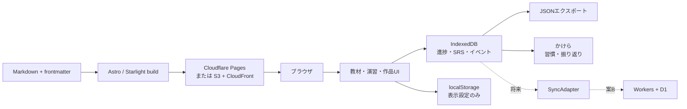
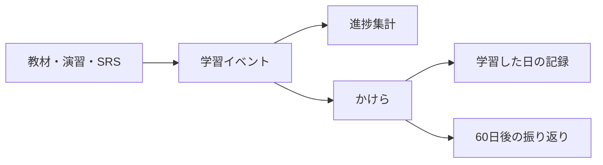

# 12.〈本題〉アーキテクチャ — 個人ひとりの静的学習サイト

調査: codex + web search（2026-08-25）／trackC・track7 の統合

---

## 結論 — 案A: Astro + Starlight による静的サイト完結型

教材は Markdown、作品・ゲームは同一サイト内の独立ページ、
**進捗・復習記録は IndexedDB**。サーバー・アカウント・同期は現段階では持たない。

**重要なのは、将来 案B へ移行できるよう最初から境界を分けておくこと。**

| 層 | 置き場所 |
|---|---|
| 教材の定義 | **Git で管理する Markdown / frontmatter** |
| 学習者の状態 | **IndexedDB** |
| 学習イベント | **xAPI 風の追記ログ** |
| 習慣の集計 | **「かけら」がイベントから派生させる** |
| 同期 | 将来追加する**交換可能なアダプター** |



---

## 1. アーキテクチャ3案の比較

| 評価軸 | **案A: 静的完結** | 案B: 静的＋薄いバックエンド | 案C: Moodle 等 |
|---|---|---|---|
| 初期コスト | **低** | 中（認証・DB・API・権限設計） | 高（PHP・DB・メール・cron・TLS） |
| 運用コスト | **最小** | 中（DB移行・認証・障害・利用量監視） | 高（更新・バックアップ・セキュリティ） |
| 学習効果 | 個人用途には十分 | 複数端末・通知・履歴保全で向上 | 課題提出・採点では強いが一人には摩擦 |
| 将来の公開 | 教材・作品の公開に非常に強い（進捗は端末別） | アカウント付き公開に強い | 本格的な受講管理に強い |
| データ持ち出し | **Markdown + JSON で非常に良い** | D1/SQLite・Postgres なら良い | Moodle バックアップ依存で重い |
| 無料運用 | **可能** | 小規模なら可能だが無料枠変更の影響 | ソフトは無料でもサーバー費と保守時間 |
| **今回の適合度** | **最適** | 複数端末が必要になった時点で | **過剰** |

### 案A で足りる条件（いま全部満たしている）

- 学習者は一人
- 主端末を決められる
- 手動 JSON バックアップを許容できる
- 教材や作品は公開してよい
- **成績証明・教師による採点・受講者管理が不要**

> 進捗をサーバーに置かなくても、**教材構造・演習結果・復習キュー・ストリーク・学習時間は
> すべて実装できる**。

### 案B へ移る条件（＝それまでは作らない）

- PC とスマートフォンの**自動**同期
- ログイン後にどの端末でも再開
- 公開サイトで**複数利用者**の進捗を分離
- サーバー側通知・ランキング・提出物保存
- ブラウザデータ消去でも失われない自動バックアップ

**第一候補: Cloudflare Workers + D1**（配信先を Cloudflare に寄せるなら）
D1 無料枠は 1 DB 500 MB / アカウント合計 5 GB、Workers 無料枠は 1日10万リクエスト。

| 代替 | 利点 | 注意点 |
|---|---|---|
| **Supabase** | Postgres・Auth・RLS・標準的な SQL エクスポート | 無料枠は 2 プロジェクト / DB 500MB / 5万MAU。**低活動プロジェクトは休止対象** |
| **Firebase** | 認証導入が容易。Firestore 無料枠 1GiB / 日5万read・2万write | **データモデルとエクスポートが Firestore 依存**になる |
| **PocketBase** | SQLite・認証・API・管理画面が単一実行ファイル | **自分で常時稼働・更新・バックアップ。v1.0 前は後方互換を保証しない** |
| KV | 設定値・セッション向け | 進捗履歴の検索や競合解決には D1 が自然 |

### 案C（Moodle）を採る条件

Moodle 5.2.2 は PHP と MariaDB/MySQL/Postgres を必要とする。
**教師・複数受講者・提出期限・採点・修了証・監査可能な記録が必要になった場合に限る。**

---

## 2. コンテンツ設計 — content as code

### ディレクトリ

```
src/
├── content.config.ts
├── content/
│   ├── courses/                    # コースのメタ定義
│   │   ├── web-foundations.yaml
│   │   ├── linux.yaml
│   │   └── git.yaml
│   ├── docs/                       # Starlight の教材本体
│   │   └── courses/
│   │       ├── web-foundations/
│   │       │   ├── index.md
│   │       │   └── 01-network/
│   │       │       ├── 01-dns.md
│   │       │       ├── 02-https.md
│   │       │       └── 03-aws-project.md
│   │       ├── linux/
│   │       │   └── 01-basics/
│   │       │       ├── 01-filesystem.md
│   │       │       └── 02-story-quest.md
│   │       └── git/
│   │           └── 01-basics/
│   │               └── 01-git-dungeon.md
│   ├── review-cards/               # SRS カード
│   │   ├── dns.yaml
│   │   └── git-basics.yaml
│   └── glossary/                   # 用語集
│       ├── dns.yaml
│       └── origin.yaml
├── components/learning/
│   ├── CompleteButton.astro
│   ├── ExerciseFrame.astro
│   ├── ReviewPanel.astro
│   └── ProgressBar.astro
├── lib/
│   ├── learning-store/             # IndexedDB
│   │   ├── indexeddb.ts
│   │   ├── export.ts
│   │   └── migrations.ts
│   ├── srs/                        # ts-fsrs
│   ├── events/                     # xAPI 風イベント
│   └── habits/                     # かけら連携
└── pages/
    ├── index.astro                 # ヴィクトリア朝のトップ（通常の Astro ページ）
    ├── about.astro
    ├── works.astro
    ├── dashboard.astro             # 今日やること
    ├── review.astro                # 復習キュー
    └── settings/data.astro         # エクスポート／インポート

public/
└── works/                          # ゲーム・アプリを無改造で同居
    ├── linux-story-quest/
    ├── git-dungeon/
    └── kakera/
```

> **数字プレフィックスは人間と sidebar のためのもの。進捗の主キーには使わない。
> 進捗は必ず変更しない `id` で参照する。**

### frontmatter スキーマ

```yaml
---
id: web.dns.authoritative-server      # ★ 不変。進捗はこれで参照する
title: 権威DNSサーバーとは
description: DNS問い合わせが権威サーバーへ届くまでを理解する
course: web-foundations
chapter: network
kind: article                          # article | exercise | project
order: 20                              # 表示順

prerequisites:                         # 学習可能性（order とは別概念）
  - web.dns.overview

estimatedMinutes: 15
difficulty: beginner                   # beginner | intermediate | advanced
outcomes:
  - 再帰DNSと権威DNSを区別できる
  - digの結果から問い合わせ先を読める

completion:
  mode: manual                         # manual | checklist | event | score
  requiredChecklist: []
  eventName: null
  minimumScore: null

review:
  enabled: true
  cardSet: dns-authoritative

artifact: null
status: published                      # draft | published | archived
contentVersion: 1
updatedAt: 2026-08-25
---
```

**演習の場合:**

```yaml
kind: exercise
completion:
  mode: event
  eventName: quest.completed
exercise:
  launch: /works/linux-story-quest/
  attemptLimit: null
  passRequired: true
```

**成果物の場合:**

```yaml
kind: project
completion:
  mode: checklist
  requiredChecklist:
    - deployed
    - readme-written
    - retrospective-written
artifact:
  repository: https://github.com/example/project
  demo: /works/project/
  license: MIT
```

### 設計上のルール

- **`order` は表示順、`prerequisites` は学習可能性。混同しない**
- **前提条件は強制ロックではなく警告を標準とする**
- `estimatedMinutes` は「今日の学習量」を組み立てる入力
- 完了は種類別に判定する（記事＝手動 / 演習＝イベント or 得点 / 成果物＝チェックリスト＋URL）
- **Markdown 本文に進捗状態を書かない**
- **URL 変更に耐える不変 `id` を必須にする**
- **`contentVersion` 増加時も完了を取り消さず「更新あり」と表示する**

---

## 3. 進捗をブラウザだけで持つ

### 保存先の分担

| 保存先 | 保存するもの |
|---|---|
| **localStorage** | テーマ、sidebar 開閉、最後に開いたコース ── **失ってよい UI 設定だけ** |
| **IndexedDB** | 完了状況、チェック項目、SRS カード、復習履歴、bookmark、イベントログ |
| **JSON ファイル** | バックアップ、端末移行、将来のサーバー移行 |

> **進捗を localStorage だけに置かない。**
> 現在の「かけら」のデータも、統合時には IndexedDB へマイグレーションする。
> IndexedDB 上は巨大な単一 JSON にせず、`units` / `reviewCards` / `events` /
> `bookmarks` / `dailyStats` を**別 object store** にする。

### エクスポート JSON

```json
{
  "format": "spartan-learning-export",
  "schemaVersion": 1,
  "exportedAt": "2026-08-25T10:30:00.000Z",
  "profile": { "id": "local:8f86c44d", "timezone": "Asia/Tokyo" },

  "units": {
    "web.dns.authoritative-server": {
      "status": "completed",
      "startedAt": "2026-08-23T08:00:00.000Z",
      "completedAt": "2026-08-23T08:18:00.000Z",
      "lastOpenedAt": "2026-08-25T09:10:00.000Z",
      "contentVersionCompleted": 1,
      "checklist": {},
      "attempts": 1,
      "bestScore": null,
      "updatedAt": "2026-08-25T09:10:00.000Z"
    }
  },

  "reviewCards": {
    "dns-authoritative:recursive-vs-authoritative": {
      "state": "review",
      "due": "2026-08-29T00:00:00.000Z",
      "stability": 5.42,
      "difficulty": 4.71,
      "elapsedDays": 3,
      "scheduledDays": 5,
      "reps": 3,
      "lapses": 0,
      "lastReview": "2026-08-24T12:00:00.000Z"
    }
  },

  "bookmarks": [
    { "id": "bookmark:01J...", "unitId": "web.dns.authoritative-server",
      "headingId": "recursive-query", "note": "dig +traceで再確認",
      "createdAt": "2026-08-23T08:12:00.000Z" }
  ],

  "events": [
    { "id": "01J...", "actor": "local:8f86c44d", "verb": "completed",
      "object": "unit:web.dns.authoritative-server",
      "result": { "durationSeconds": 1080 },
      "context": { "course": "web-foundations", "contentVersion": 1 },
      "timestamp": "2026-08-23T08:18:00.000Z" }
  ]
}
```

### データを失わない設計

- 初回完了後と **30日ごと**に JSON バックアップを促す
- インポート前にスキーマ検証し、**自動スナップショットを作る**
- イベントは UUID で**和集合**
- 同一進捗レコードは `updatedAt` の新しい方を採用
- 削除同期に備え、将来は `tombstone` を使用
- **`navigator.storage.persist()` を依頼する**（ただしブラウザが許可するとは限らない）
- ⚠ **ブラウザ保存は既定で best-effort。ユーザー操作やストレージ圧迫で消える。
  エクスポートは省略できない**
- **サーバー無しの自動複数端末同期は実現しない。** 案A では JSON 受け渡し

---

## 4. SRS（間隔反復）— ts-fsrs

**Anki 公式も FSRS を SM-2 の代替として採用**しており、同じ時間でより多く保持できる可能性がある。
標準の目標保持率は 90%。保持率を上げるほど復習量が急増する。

| 名前 | リポジトリ / ライセンス / 活動 | 判定 |
|---|---|---|
| **ts-fsrs** | [open-spaced-repetition/ts-fsrs](https://github.com/open-spaced-repetition/ts-fsrs) · **MIT** · v5.4.1（2026-06） | **採用**。TS/ESM/CJS/UMD 対応、Node 20+ |
| **Anki 本体** | [ankitects/anki](https://github.com/ankitects/anki) · **AGPL-3.0-or-later** · 26.05 系（2026-06） | **サイトに SRS を再実装しないなら、まずこれを別アプリとして使う** |
| SM-2 | — | 実装は単純だが、新規実装で積極的に選ぶ理由は少ない |
| **Recall** | [Madlezz/Recall](https://github.com/Madlezz/Recall) · MIT · v1.2.0（2026） | 非常に新しい小規模プロジェクト。実験用途 |

### ⚠ FSRS の対象は「レッスン」ではなく「思い出せる単位のカード」

- ❌ 悪い例: 「DNS の記事を復習する」
- ✅ 良い例: 「**再帰DNSと権威DNSの違いを説明する**」
- 評価は Again / Hard / Good / Easy
- 初期は標準パラメータ。**数百件のレビュー履歴が貯まるまで個人最適化しない**

---

## 5. 学習サイト特有の UI

| UI | 推奨実装 |
|---|---|
| 追従目次・scrollspy | **Starlight の右目次**（自作不要） |
| 読了進捗バー | Starlight コンポーネント override + 小さな Custom Element |
| 前後レッスン | **Starlight sidebar 順から自動生成**（内部も sidebar から prev/next を算出） |
| bookmark | 見出し ID + unit ID + メモを IndexedDB へ |
| チェックリスト | **Markdown 上の初期値と IndexedDB 上の学習者状態を分離**。`remark-gfm` の task list は disabled checkbox になるので**保存可能なものは専用コンポーネント** |
| コードのコピー | **Starlight 標準の Expressive Code**（MIT・v0.44.1・コピーボタン／キーボード／読み上げ通知つき） |
| glossary | `glossary` collection を設け、用語ページと初出リンクを生成 |
| 脚注 | `remark-gfm` |
| ネタバレ折りたたみ | **`<details><summary>`（JS 不要）** |
| 演習埋め込み | **同一 origin のページを優先**。iframe の場合は `postMessage` で完了イベント送信 |

> `rehype-autolink-headings` も実在するが **Starlight と重複するため初期採用しない**。
> `@simonhyll/starlight-glossary` は**ライセンスと最新リリース時期を十分確認できなかったため不採用**、
> 小さな自前 collection を選ぶ。

### アクセシビリティ要件

- 完了・bookmark・復習評価は**すべてキーボード操作可能**に
- click 可能な `div` ではなく **`button` と `a`** を使う
- 進捗更新は **`aria-live="polite"`** で通知
- sidebar や dialog を閉じたら、**開いたボタンへフォーカスを戻す**
- **「正解」を色だけで表現しない**
- コードブロックの横スクロール領域をキーボードで操作可能に
- 見出し階層を飛ばさない
- **ゲーム内にも「ゲームを飛ばして文章版で学ぶ」経路を用意する**

#### SPA 画面切替の推奨パターン（かけら／ゲームに適用）

1. 新しい view を描画
2. `document.title` を変更
3. **`tabindex="-1"` を付けた新しい `h1` へフォーカス**
4. ページ上部へスクロール
5. 保存完了など、フォーカス移動では伝わらない状態だけ `aria-live="polite"` で通知

> **現行「かけら」はかなり適切に実装済み**（live region: `index.html:35`、
> 同一文の再通知: `main.js:46`、通常ナビ後の `h1.focus()`: `main.js:126`）。
> ⚠ **ただし `popstate`（戻る/進む）側（`main.js:194`）は再描画とスクロールだけで、
> 見出しへのフォーカス移動がない。`navigate()` と共通関数化すべき。**
> 画面ごとの `document.title` 更新も追加候補。

---

## 6. 「ひとりで続ける」ための仕組み

ダッシュボードは、**数値を増やすゲームではなく「次に何をすればよいか」を一画面で示す**。

### 今日やることの生成規則

1. **期限超過の復習カード**
2. 学習中レッスンの続き
3. 前提条件を満たした次の短いレッスン
4. 余裕があれば成果物の小タスク

`estimatedMinutes` から **20〜30分程度**に収める。
**復習の滞納が多い日は新規教材を抑える**（Anki が「復習が滞っている場合は新規カードを増やさない」
と勧める設計と一致）。

### ⚠ ストリークの扱い — 設計思想と衝突しうる

> **「かけら」は連続日数や達成率を意図的に持たない設計**（`docs/PRESENTATION.md:20`）。
> その思想を壊さないこと。

- Asia/Tokyo の日付境界で集計
- 1回開いただけでなく、**完了・復習・一定時間の学習**を対象に
- **現在ストリークより「過去30日の学習日数」を大きく表示する**
- **途切れを罰として扱わない**
- **連続日数のためだけの無意味な操作を促さない**
- ヒートマップを使うなら「連続記録」「未達」を強調せず、月ごとの学習量や分野の分布だけ

### 「かけら」の位置づけ直し

**学習進捗 DB そのものにせず、学習習慣・振り返りレイヤーにする。**



| | 役割 |
|---|---|
| 学習サイト | 何を完了し、何を覚えているか |
| SRS | 次にいつ思い出すべきか |
| **かけら** | **今日学習に向き合ったか、何を感じたか** |
| **60日ルール** | **60日前の学習記録と現在を比較する振り返り** |

> **「かけら」が完了状態を別保存すると二重管理になる。**
> 学習イベントを入力として日次の習慣記録を**派生させる**。
> 自由記述の感想だけを「かけら」固有データとして保持する。

---

## 7. 実装順

1. 既存の記事・授業メモ・ゲーム・作品を `kind` 付き Unit へ移す
2. sidebar・前後移動・作品埋め込みを Starlight で構成
3. IndexedDB へ完了・bookmark・イベントを保存
4. **JSON エクスポート／インポートを先に完成させる**
5. `ts-fsrs` による復習キューを追加
6. 「かけら」をイベント購読型の習慣・60日振り返り画面へ移す
7. **実際に複数端末同期が必要になった時だけ** Workers + D1 を追加する

> 現時点では、LMS を導入するより
> **Starlight のドキュメント構造に「Unit・完了条件・前提条件・SRSカード・学習イベント」を
> 足す方が目的に合う。**
