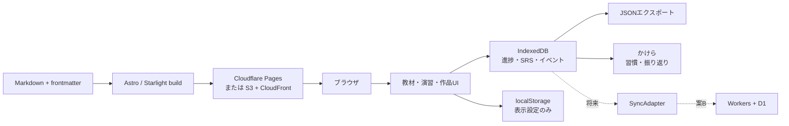
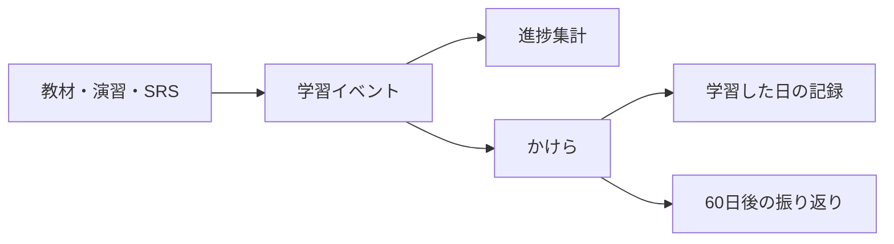

# 第3ラウンド トラックC：個人ひとりの静的学習サイトのアーキテクチャ設計

調査日: 2026-08-25

## 結論

第一推奨は、**案A「Astro + Starlightによる静的サイト完結型」**である。

教材はMarkdown、作品・ゲームは同一サイト内の独立ページ、進捗・復習記録はIndexedDBに保存する。サーバー、アカウント、同期機能は現段階では持たない。Cloudflare Pagesまたは現在のS3 + CloudFrontで配信できる。

重要なのは、将来案Bへ移行できるよう、最初から次の境界を分けておくことである。

- 教材の定義: Gitで管理するMarkdown/frontmatter
- 学習者の状態: IndexedDB
- 学習イベント: xAPI風の追記ログ
- 習慣の集計: 「かけら」がイベントから派生させる
- 同期: 将来追加する交換可能なアダプター



---

## 1. アーキテクチャ3案の比較

| 評価軸 | 案A: 静的サイト完結 | 案B: 静的＋薄いバックエンド | 案C: Moodle等 |
|---|---|---|---|
| 初期コスト | 低。Markdown移行とローカル進捗実装 | 中。認証、DB、API、権限設計が増える | 高。PHP、DB、メール、cron、TLS等が必要 |
| 運用コスト | 最小。ビルドと依存更新が中心 | 中。DB移行、認証、障害、利用量監視 | 高。アップデート、バックアップ、セキュリティ対応 |
| 学習効果 | 個人用途には十分。演習、SRS、今日の課題を実装可能 | 複数端末、通知、履歴保全で向上 | 課題提出・採点・教師・コホートでは強いが、一人には摩擦が多い |
| 将来の公開 | 教材・作品の公開に非常に強い。進捗は端末別 | アカウント付き一般公開に強い | 本格的な受講管理に強い |
| データ持ち出し | Markdown + JSONで非常に良い | D1/SQLiteやSupabase/Postgresなら良い | Moodleバックアップ等に依存し、構造が重い |
| 無料運用 | 可能 | 小規模なら可能だが無料枠変更の影響を受ける | ソフトは無料でもサーバー費と保守時間が必要 |
| 今回の適合度 | **最適** | 複数端末が必要になった時点で採用 | 過剰 |

### 案Aが適する範囲

以下が成立する間は案Aでよい。

- 学習者は一人
- 主端末を決められる
- 手動JSONバックアップを許容できる
- 教材や作品は公開してよい
- 成績証明、教師による採点、受講者管理が不要

進捗をサーバーに置かなくても、教材構造、演習結果、復習キュー、ストリーク、学習時間は実装できる。

### 案Bへ移る条件

次のいずれかが実需要になった時点が境界である。

- PCとスマートフォンの自動同期
- ログイン後にどの端末でも再開
- 公開サイトで複数利用者の進捗を分離
- サーバー側通知、ランキング、提出物保存
- ブラウザデータ消去でも失われない自動バックアップ

第一候補は、配信先をCloudflareに寄せるならWorkers + D1である。D1はSQLite互換のサーバーレスDBで、無料プランは1 DB 500 MB、アカウント合計5 GB、Workers無料枠は1日10万リクエストであり、個人の進捗同期には十分余裕がある。[D1 limits](https://developers.cloudflare.com/d1/platform/limits/)、[Workers limits](https://developers.cloudflare.com/workers/platform/limits/)

代替は次の通り。

- Supabase: Postgres、Auth、Row Level Security、標準的なSQLエクスポートが利点。無料枠は2プロジェクト、DB 500 MB、5万MAUだが、低活動プロジェクトは休止対象。[公式料金・制限](https://supabase.com/docs/guides/platform/billing-on-supabase)
- Firebase: 認証導入が容易。Firestore無料枠は1 GiB、1日5万read・2万write。ただしデータモデルとエクスポートがFirestore依存になる。[Firestore pricing](https://firebase.google.com/docs/firestore/pricing)
- PocketBase: SQLite、認証、API、管理画面を単一実行ファイルで提供。ただし自分で常時稼働、更新、バックアップする必要があり、v1.0前は後方互換を保証していない。[公式リポジトリ](https://github.com/pocketbase/pocketbase)
- KV: 設定値やセッションには向くが、進捗履歴・SRS履歴の検索や競合解決にはD1の方が自然

### 案Cを採用する条件

Moodleは、コース、受講者、教師、Activity、Resource、Quiz、Grade、Completion、Competencyを第一級概念に持つ。本格的な教育組織の設計を学ぶ資料としては優秀である。Moodle自身も「Activity＝学習者が行うもの」「Resource＝教師が提示するもの」を分離している。[Activities](https://docs.moodle.org/501/en/Activities)、[Resources](https://docs.moodle.org/501/en/Resources)

しかし最新版Moodle 5.2.2はPHP、MariaDB/MySQL/Postgres等を必要とする。[公式ダウンロード](https://download.moodle.org/releases/latest/) 一人の静的サイトでは、登録、権限、成績表、メッセージ、cronなど大半が不要である。

したがってMoodleを採用するのは、教師・複数受講者・提出期限・採点・修了証・監査可能な記録が必要になった場合に限る。

---

## 2. content as codeの設計

Astro Content Collectionsは、同じ構造を持つMarkdown群にスキーマ、型検査、参照、クエリを与える。[公式ドキュメント](https://docs.astro.build/en/guides/content-collections/) Starlightは`docs`コレクション、frontmatter、sidebar、前後ページを持ち、学習サイトの外枠として転用しやすい。[sidebar](https://starlight.astro.build/guides/sidebar/)、[frontmatter](https://starlight.astro.build/reference/frontmatter/)

Docusaurusもディレクトリからsidebarを生成し、`index.md`とカテゴリを対応させる型を持つ。[autogenerated sidebar](https://docusaurus.io/docs/sidebar/autogenerated) ただしReact/MDX中心のため、素のJSに近い構成を望む今回はStarlightの方が軽い。

### 抽出すべきドメインモデル

```text
Course
└── Chapter
    └── Unit
        ├── Article   読む
        ├── Exercise  試す・判定する
        └── Project   作る・公開する

LearnerState
├── UnitProgress
├── ReviewCard
├── Bookmark
├── ChecklistState
└── LearningEvent
```

「記事」「演習」「成果物」を別サイトに分けず、すべて`Unit`の種類として扱う。共通して順序、前提条件、所要時間、完了条件を持たせる。

### 推奨ディレクトリ

```text
src/
├── content.config.ts
├── content/
│   ├── courses/
│   │   ├── web-foundations.yaml
│   │   ├── linux.yaml
│   │   └── git.yaml
│   ├── docs/
│   │   └── courses/
│   │       ├── web-foundations/
│   │       │   ├── index.md
│   │       │   ├── 01-network/
│   │       │   │   ├── 01-dns.md
│   │       │   │   ├── 02-https.md
│   │       │   │   └── 03-aws-project.md
│   │       │   └── 02-browser/
│   │       ├── linux/
│   │       │   ├── index.md
│   │       │   └── 01-basics/
│   │       │       ├── 01-filesystem.md
│   │       │       └── 02-story-quest.md
│   │       └── git/
│   │           └── 01-basics/
│   │               └── 01-git-dungeon.md
│   ├── review-cards/
│   │   ├── dns.yaml
│   │   └── git-basics.yaml
│   └── glossary/
│       ├── dns.yaml
│       ├── origin.yaml
│       └── repository.yaml
├── components/
│   ├── learning/
│   │   ├── CompleteButton.astro
│   │   ├── ExerciseFrame.astro
│   │   ├── ReviewPanel.astro
│   │   └── ProgressBar.astro
│   └── works/
├── lib/
│   ├── learning-store/
│   │   ├── indexeddb.ts
│   │   ├── export.ts
│   │   └── migrations.ts
│   ├── srs/
│   ├── events/
│   └── habits/
└── pages/
    ├── dashboard.astro
    ├── review.astro
    ├── works/
    └── settings/data.astro

public/
└── works/
    ├── linux-story-quest/
    ├── git-dungeon/
    └── kakera/
```

数字プレフィックスは人間とsidebarのため、進捗の主キーには使わない。進捗は必ず変更しない`id`で参照する。

### frontmatterスキーマ

```yaml
---
id: web.dns.authoritative-server
title: 権威DNSサーバーとは
description: DNS問い合わせが権威サーバーへ届くまでを理解する
course: web-foundations
chapter: network
kind: article                 # article | exercise | project
order: 20

prerequisites:
  - web.dns.overview

estimatedMinutes: 15
difficulty: beginner          # beginner | intermediate | advanced
outcomes:
  - 再帰DNSと権威DNSを区別できる
  - digの結果から問い合わせ先を読める

completion:
  mode: manual                # manual | checklist | event | score
  requiredChecklist: []
  eventName: null
  minimumScore: null

review:
  enabled: true
  cardSet: dns-authoritative

artifact: null

status: published             # draft | published | archived
contentVersion: 1
updatedAt: 2026-08-25
---
```

演習の場合:

```yaml
kind: exercise
completion:
  mode: event
  eventName: quest.completed
exercise:
  launch: /works/linux-story-quest/
  attemptLimit: null
  passRequired: true
```

成果物の場合:

```yaml
kind: project
completion:
  mode: checklist
  requiredChecklist:
    - deployed
    - readme-written
    - retrospective-written
artifact:
  repository: https://github.com/example/project
  demo: /works/project/
  license: MIT
```

### 設計上のルール

- `order`は表示順、`prerequisites`は学習可能性。混同しない
- 前提条件は強制ロックではなく警告を標準とする
- `estimatedMinutes`は今日の学習量を組み立てる入力
- 完了は種類別に判定する
  - 記事: 手動完了
  - 演習: ゲームからの完了イベントまたは得点
  - 成果物: チェックリストとURL
- Markdown本文に進捗状態を書かない
- URL変更に耐える不変`id`を必須にする
- `contentVersion`増加時も完了を取り消さず、「更新あり」と表示する

---

## 3. ブラウザだけで持つ進捗・学習記録

### localStorageとIndexedDB

`localStorage`は同期APIで文字列のみを扱うため、大きな履歴はメインスレッドを止め得る。IndexedDBは非同期で、構造化データ、索引、トランザクションを扱える。[Web Storage](https://developer.mozilla.org/en-US/docs/Web/API/Web_Storage_API)、[IndexedDB](https://developer.mozilla.org/en-US/docs/Web/API/IndexedDB_API)

推奨分担は以下である。

| 保存先 | 保存するもの |
|---|---|
| localStorage | テーマ、sidebar開閉、最後に開いたコースなど、失ってよいUI設定 |
| IndexedDB | 完了状況、チェック項目、SRSカード、復習履歴、bookmark、イベントログ |
| JSONファイル | バックアップ、端末移行、将来のサーバー移行 |

進捗をlocalStorageだけに置かない。現在の「かけら」のデータも、統合時にはIndexedDBへマイグレーションする。

### 推奨JSON構造

```json
{
  "format": "spartan-learning-export",
  "schemaVersion": 1,
  "exportedAt": "2026-08-25T10:30:00.000Z",
  "profile": {
    "id": "local:8f86c44d",
    "timezone": "Asia/Tokyo"
  },
  "units": {
    "web.dns.authoritative-server": {
      "status": "completed",
      "startedAt": "2026-08-23T08:00:00.000Z",
      "completedAt": "2026-08-23T08:18:00.000Z",
      "lastOpenedAt": "2026-08-25T09:10:00.000Z",
      "contentVersionCompleted": 1,
      "checklist": {},
      "attempts": 1,
      "bestScore": null,
      "updatedAt": "2026-08-25T09:10:00.000Z"
    }
  },
  "reviewCards": {
    "dns-authoritative:recursive-vs-authoritative": {
      "state": "review",
      "due": "2026-08-29T00:00:00.000Z",
      "stability": 5.42,
      "difficulty": 4.71,
      "elapsedDays": 3,
      "scheduledDays": 5,
      "reps": 3,
      "lapses": 0,
      "lastReview": "2026-08-24T12:00:00.000Z"
    }
  },
  "bookmarks": [
    {
      "id": "bookmark:01J...",
      "unitId": "web.dns.authoritative-server",
      "headingId": "recursive-query",
      "note": "dig +traceで再確認",
      "createdAt": "2026-08-23T08:12:00.000Z"
    }
  ],
  "events": [
    {
      "id": "01J...",
      "actor": "local:8f86c44d",
      "verb": "completed",
      "object": "unit:web.dns.authoritative-server",
      "result": {
        "durationSeconds": 1080
      },
      "context": {
        "course": "web-foundations",
        "contentVersion": 1
      },
      "timestamp": "2026-08-23T08:18:00.000Z"
    }
  ]
}
```

IndexedDB上は巨大な単一JSONにせず、`units`、`reviewCards`、`events`、`bookmarks`、`dailyStats`を別object storeにする。

### SRSの選択

推奨は**FSRS + ts-fsrs**である。

Anki公式もFSRSを従来のSM-2代替として採用し、同じ時間でより多く保持できる可能性を説明している。標準の目標保持率は90%で、保持率を上げるほど復習量が急増する。[Anki FSRS](https://docs.ankiweb.net/deck-options.html#fsrs)

`ts-fsrs`はTypeScript/ESM/CommonJS/UMD対応の実装で、Node.js 22環境に適合する。[リポジトリ](https://github.com/open-spaced-repetition/ts-fsrs)

ただし、FSRSの対象は「レッスン」ではなく、思い出せる単位のカードにする。

- 悪い例: 「DNSの記事を復習する」
- 良い例: 「再帰DNSと権威DNSの違いを説明する」
- 評価: Again / Hard / Good / Easy
- 初期は標準パラメータ
- 数百件程度のレビュー履歴が貯まるまでは個人最適化しない

SM-2は実装が単純だが、新規実装で積極的に選ぶ理由は少ない。Anki本体との同期が目的ならAnkiを別アプリとして使う方がよいが、教材ページ内の復習キューには`ts-fsrs`が自然である。

### エクスポート、複数端末、データ消失

- 初回完了後と30日ごとにJSONバックアップを促す
- インポート前にスキーマ検証し、自動スナップショットを作る
- イベントはUUIDで和集合
- 同一進捗レコードは`updatedAt`の新しい方を採用
- 削除同期に備え、将来は`tombstone`を使用
- `navigator.storage.persist()`を依頼する。ただしブラウザが許可するとは限らない。[StorageManager.persist](https://developer.mozilla.org/en-US/docs/Web/API/StorageManager/persist)
- ブラウザ保存は既定でbest-effortであり、ユーザー操作やストレージ圧迫で消える可能性があるため、エクスポートは省略できない。[保存容量とeviction](https://developer.mozilla.org/en-US/docs/Web/API/Storage_API/Storage_quotas_and_eviction_criteria)
- サーバー無しの自動複数端末同期は実現しない。案AではJSON受け渡し、案Bで初めて同期を提供する

### xAPI風ログは現実的か

**xAPI互換LRSを作るのは過剰だが、xAPI風イベントモデルをローカルに持つのは現実的**である。

xAPI Statementの中核はActor / Verb / Objectで、Result、Context、Timestampを追加できる。[xAPI data model](https://github.com/adlnet/xAPI-Spec/blob/master/xAPI-Data.md)

採用するイベントは限定する。

```text
opened
started
completed
attempted
passed
failed
reviewed
bookmarked
session-completed
```

利点は、ゲーム、記事、SRS、「かけら」が同じ形式で連携できることにある。ただしLRS API、IRI語彙、OAuth、全文xAPI検証までは実装しない。「xAPI-inspired」と明記する。

---

## 4. 学習サイト特有のUI

| UI | 推奨実装 |
|---|---|
| 追従目次・scrollspy | Starlightの右目次を利用。独自化時はIntersectionObserver |
| 読了進捗バー | Starlightコンポーネントoverride + 小さなCustom Element |
| 前後レッスン | Starlight sidebar順から自動生成。内部実装もprev/nextをsidebarから算出している。[実装](https://github.com/withastro/starlight/blob/main/packages/starlight/utils/navigation.ts) |
| bookmark | 見出しID + unit ID +メモをIndexedDBへ |
| チェックリスト | Markdown上の初期値と、IndexedDB上の学習者状態を分離 |
| コードコピー | Starlight標準のExpressive Code |
| glossary | `glossary` collectionを設け、用語ページと初出リンクを生成 |
| 脚注 | `remark-gfm` |
| ネタバレ | HTMLの`<details><summary>`。JS不要 |
| 演習埋め込み | 同一originのページを優先。iframeの場合は`postMessage`で完了イベント送信 |

StarlightはExpressive Codeを標準利用し、コードマーカーやウィンドウ表示を提供する。[Starlight authoring](https://starlight.astro.build/guides/authoring-content/) Expressive Codeはコピーボタン、キーボードアクセス、スクリーンリーダー向けコピー通知も持つ。[リリースノート](https://expressive-code.com/releases/)

`remark-gfm`はtask list、脚注、表などを提供する。[リポジトリ](https://github.com/remarkjs/remark-gfm) ただし表示用task listはdisabled checkboxになるため、保存可能な学習チェックリストは専用コンポーネントにする。

`rehype-autolink-headings`も実在し、見出しへの自己リンクを追加する。[リポジトリ](https://github.com/rehypejs/rehype-autolink-headings) ただしStarlightと重複するため初期採用しない。

`@simonhyll/starlight-glossary`というStarlight用候補も存在するが、今回確認できた範囲ではライセンスと最新リリース時期を十分確認できなかったため不採用とし、小さな自前collectionを選ぶ。[プロジェクトページ](https://simon.hyll.nu/projects/typescript/starlight-glossary.html)

### アクセシビリティ要件

- 完了、bookmark、復習評価はすべてキーボード操作可能にする
- click可能な`div`ではなく`button`と`a`を使う
- 進捗更新は`aria-live="polite"`で通知
- sidebarやdialogを閉じたら、開いたボタンへフォーカスを戻す
- 「正解」を色だけで表現しない
- コードブロックの横スクロール領域をキーボードで操作可能にする
- 見出し階層を飛ばさない
- `details/summary`を独自div折りたたみより優先
- ゲーム内にも「ゲームを飛ばして文章版で学ぶ」経路を用意する
- 動画・音声を導入する場合は字幕・文字起こしを教材ソースとして管理する

---

## 5. 「ひとりで続ける」ための仕組み

ダッシュボードは、数値を増やすゲームではなく「次に何をすればよいか」を一画面で示す。

### 今日やることの生成規則

1. 期限超過の復習カード
2. 学習中レッスンの続き
3. 前提条件を満たした次の短いレッスン
4. 余裕があれば成果物の小タスク

`estimatedMinutes`から20〜30分程度に収める。復習の滞納が多い日は新規教材を抑える。これはAnkiが、復習が滞っている場合は新規カードを増やさないよう勧める設計とも一致する。[Anki daily limits](https://docs.ankiweb.net/deck-options.html#daily-limits)

### ストリークの扱い

- Asia/Tokyoの日付境界で集計
- 1回開いただけでなく、完了・復習・一定時間の学習を対象
- 現在ストリークより「過去30日の学習日数」を大きく表示
- 途切れを罰として扱わない
- 連続日数のためだけの無意味な操作を促さない

### 「かけら」の位置づけ直し

「かけら」は学習進捗DBそのものにせず、**学習習慣・振り返りレイヤー**とするのがよい。



役割分担は次の通り。

- 学習サイト: 何を完了し、何を覚えているか
- SRS: 次にいつ思い出すべきか
- かけら: 今日学習に向き合ったか、何を感じたか
- 60日ルール: 60日前の学習記録と現在を比較する振り返り機能

「かけら」が完了状態を別保存すると二重管理になる。学習イベントを入力として日次の習慣記録を派生させる。自由記述の感想だけを「かけら」固有データとして保持する。

---

## 6. 採用・参照OSS一覧

| 名前 | 説明・第一級概念 | Repo / License / 活性 | 規模・コスト・注意点 |
|---|---|---|---|
| Starlight | Astro向けドキュメント基盤。docs entry、sidebar、TOC、paginationを第一級概念にする | [Repo](https://github.com/withastro/starlight) / MIT / 0.41.5、2026-07-28リリース | 一人運用可。採用コスト低〜中。学習進捗は持たないため追加実装 |
| Docusaurus | docs、category、sidebar、version、localeを扱うReact系基盤 | [Repo](https://github.com/facebook/docusaurus) / MIT / 3.10.2、2026-07-10 | 一人運用可だがReact/MDXの知識が増える。今回は不採用 |
| Moodle | Course、Activity、Resource、User、Grade、Completionを持つLMS | [Repo](https://github.com/moodle/moodle) / GPL-3.0 / 5.2.2、2026-08-08 | 大規模。サーバー・DB保守が必要。個人一名には過剰 |
| ts-fsrs | Card、Review、Rating、Difficulty、Stability、Dueを扱うFSRS実装 | [Repo](https://github.com/open-spaced-repetition/ts-fsrs) / MIT / 2026-03時点でリリース継続 | 小。Node 20以上。レッスン完了ではなくカード復習に限定 |
| Expressive Code | Code block、annotation、frame、copy操作を扱う | [Repo](https://github.com/expressive-code/expressive-code) / MIT / 0.44.1、2026年夏 | Starlight標準。追加コスト低。独自コード表示との二重導入を避ける |
| remark-gfm | task list、脚注、表等のMarkdown構文 | [Repo](https://github.com/remarkjs/remark-gfm) / MIT / 4.0.1、年を含むリリース日は未確認 | 小。表示用checkboxと保存可能チェックリストを区別 |
| rehype-autolink-headings | 見出しを自己リンク化 | [Repo](https://github.com/rehypejs/rehype-autolink-headings) / MIT / 最終リリース時期未確認 | 小。Starlightと重複するので不採用 |
| Supabase | User、Auth identity、Postgres row、Storageを持つBaaS | [Repo](https://github.com/supabase/supabase) / Apache-2.0 / 2026-05に開発者リリース | 案B候補。無料休止とサービス依存に注意 |
| PocketBase | Collection、Record、User、Fileを持つ単一バイナリBaaS | [Repo](https://github.com/pocketbase/pocketbase) / MIT / 0.38.2、2026-05-22 | 小〜中。ただし常時サーバーとバックアップが必要。v1前 |
| Firebase JS SDK | Auth user、Firestore document等へアクセスするSDK | [Repo](https://github.com/firebase/firebase-js-sdk) / Apache-2.0中心 / 12.13.0、2026-05-07 | 案B候補。容易だがFirestore依存とベンダーロックに注意 |
| xAPI Specification | Actor、Verb、Objectを核にした学習イベント仕様 | [Repo](https://github.com/adlnet/xAPI-Spec) / Apache-2.0 / リリース時期未確認 | 仕様全体は重い。ローカルイベントモデルだけ参照 |

## 最終判断

現時点では、LMSを導入するより、**Starlightのドキュメント構造に「Unit、完了条件、前提条件、SRSカード、学習イベント」を足す方が目的に合う**。

実装順は次の通りである。

1. 既存の記事・授業メモ・ゲーム・作品を`kind`付きUnitへ移す
2. sidebar、前後移動、作品埋め込みをStarlightで構成
3. IndexedDBへ完了・bookmark・イベントを保存
4. JSONエクスポート/インポートを先に完成させる
5. `ts-fsrs`による復習キューを追加
6. 「かけら」をイベント購読型の習慣・60日振り返り画面へ移す
7. 実際に複数端末同期が必要になった時だけWorkers + D1を追加する

これにより、現在の素材を失わず、個人・静的・日本語・無料という制約を守りながら、将来の一般公開にも進める。